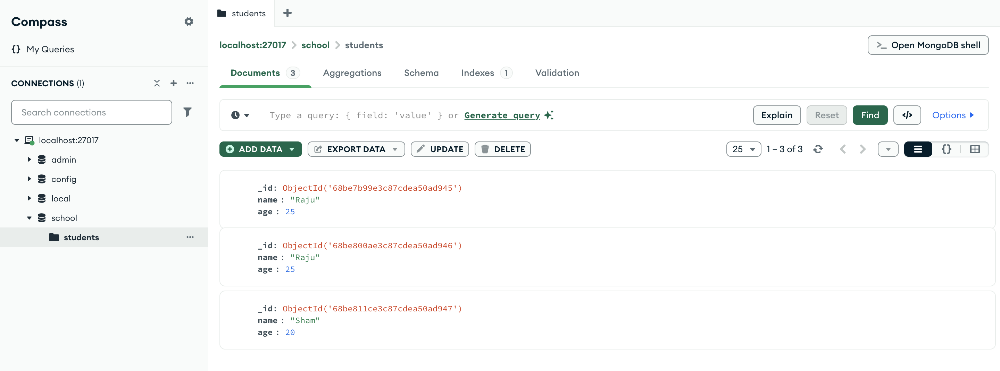

# Creating Database

```sql
-- to list all databases
show dbs

-- this commands create database if it is not present else switches to database
use school

-- command to insert data in students collection in form of document, this creates document and insert data into it
db.students.insertOne({name:"Raju", age:25})

-- command to print
db.students.find()
```


## Let's break down what is what



### 🗄️ Hierarchy in MongoDB (from top to bottom)

1. Server / Connection

   - On the left, you see `localhost:27017` → this is the **MongoDB server instance** you’re connected to.
   - It’s running on your local machine, port **27017**.

2. Database

   - Inside that server, you have several databases: `admin`, `config`, `local`, and `school`.
   - Here, `school` is the **database** you are working in.

3. Collection

   - Under the `school` database, you have `students`.
   - This is a `collection` (like a table in SQL).

4. Document
   - On the right side, you see entries such as:
   ```json
     {
     \_id: ObjectId("68be7b99e3c87cdea50ad945"),
     name: "Raju",
     age: 25
     }
   ```
   - Each of these JSON-like objects is a **document** (like a row in SQL).
   - Every document has a unique `\_id` field automatically generated by MongoDB.

#### ⚡ Quick Mapping (SQL → MongoDB in this image)

- Database (school) → SQL Database
- Collection (students) → SQL Table
- Document (Raju, Sham, etc.) → SQL Row
- Field (name, age) → SQL Column

#### 👉 So in your screenshot:

- Database: `school`
- Collection: `students`
- Documents:
- `{ \_id: ..., name: "Raju", age: 25 }`
- `{ \_id: ..., name: "Raju", age: 25 }`
- `{ \_id: ..., name: "Sham", age: 20 }`
