# CRUD - [Link](https://www.mongodb.com/resources/products/fundamentals/crud)

- CREATE
- READ
- UPDATE
- DELETE

## 1. CREATE

Avaliable Functions

- insertOne() - it insert data in form of document and creates only one document

  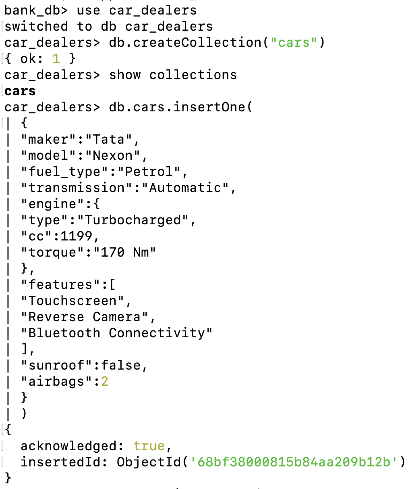

- insertMany() - it insert data and creates multiple documents at once like this ({},{},{})

  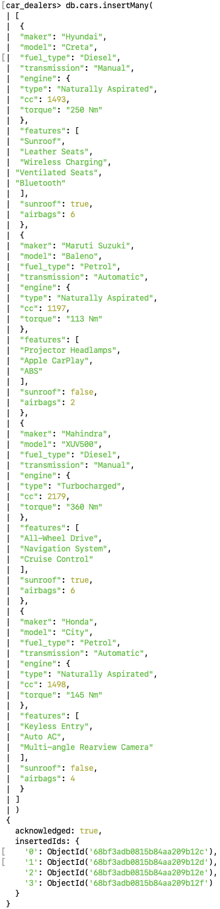

## 2. READ

Avaiable Functions

- `find()` - it finds data from all documents at once
  1 -> true
  0 -> false

    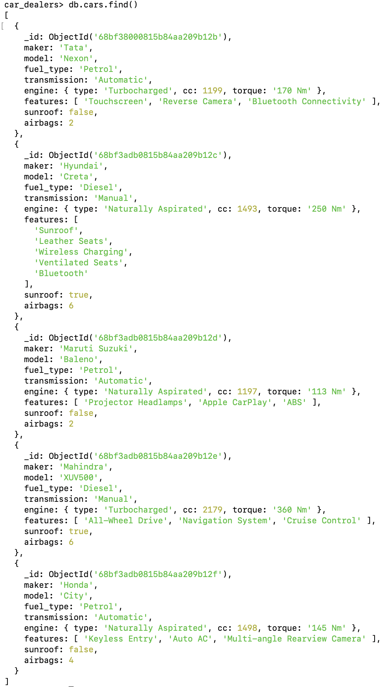

  NOTE - if sometimes data appears to be more messier, then you can use this command which makes document look more organized
  Command - `find().pretty()`

  More Examples

  - We are `using find with projection` here, for more info you can read this document - [Link](./03.%20Projection.md)

  - `find(query,projection)`

  - `find({},{model:1,maker:1,\_id:0})` - all models, makers

    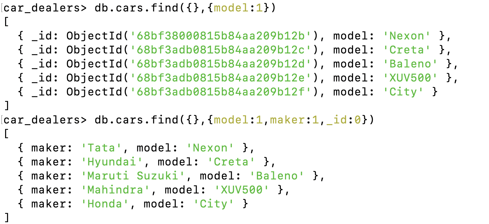

  - `find({fuel_type:"Petrol"})` - filtering all vehicles having petrol as their fuel type

    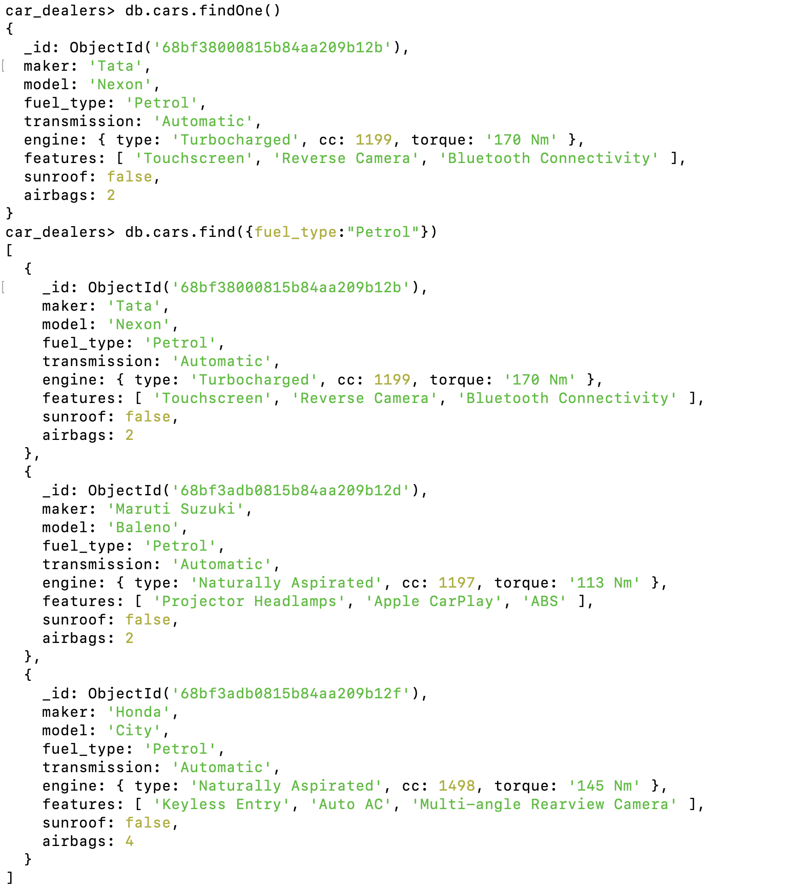

  - `find({"features":"Sunroof"})` - filtering all vehicles having feature sunroof
  - `find({"engine.type":"Turocharged"})` - filtering all vehicles having engine type Turbocharged, here we are `filtering from nested document`
    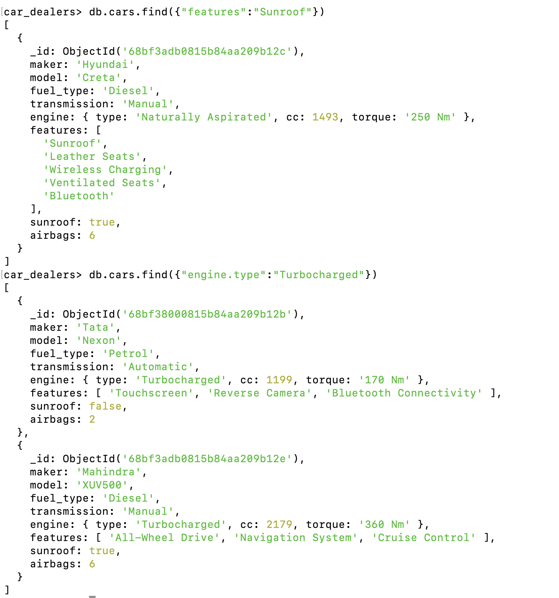

- findOne()
  - it can do everything which find can do, it will just give one result of it
    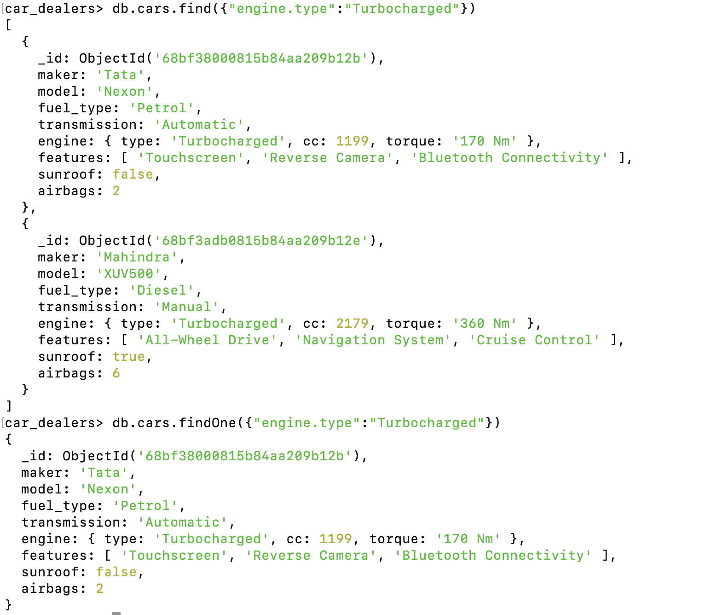

## 3. UPDATE

Available Functions

- updateOne()

  1.  To `Adds a new field or updates the value of an existing field`

      `$set` is a pre-defined operator - Adds a new field or updates the value of an existing field.

      Syntax

      Example 1

      ```js
      db.cars.updateOne({ model: "Nexon" }, { $set: { color: "Red" } });
      ```

        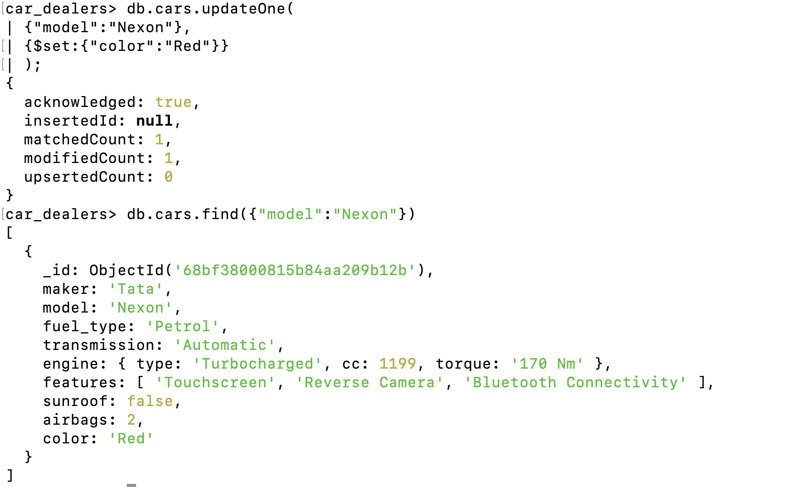

  2.  To `Removes a field from a document`

      `$unset` is a pre-defined operator - Removes a field from a document.

      Example 2

      Syntax

      ```js
      db.cars.updateOne({ model: "Nexon" }, { $unset: { color: "" } });
      ```

        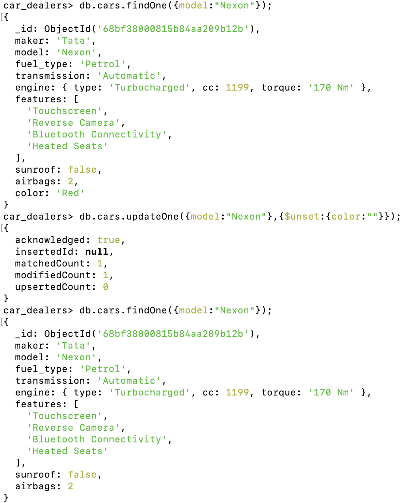

  3.  To `Add element to an array`

      `$push`

      - Appends a value to an array fiel.
      - If the field doesn’t exist, MongoDB creates it as an array.

      Example 3

      Syntax

      ```js
      db.cars.updateOne(
        { model: "Nexon" }, // Filter to find the specific document
        { $push: { features: "Heated Seats" } }
      );
      ```

        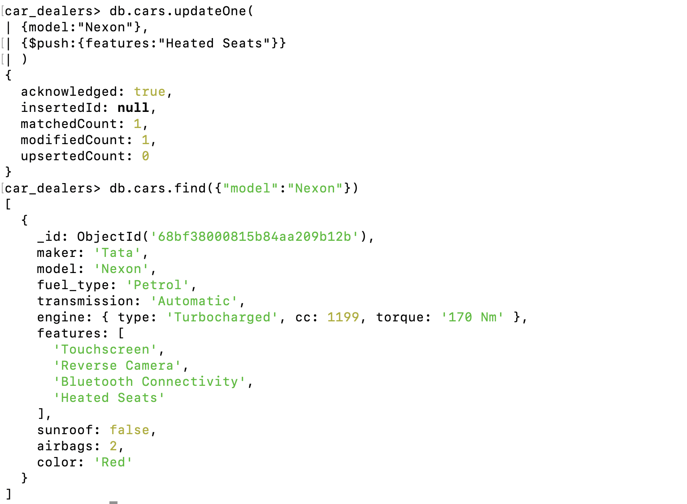

  4.  To `Remove element from an array`

      `$pull` - Removes all matching values from an array.

      Example 4

      Syntax

      ```js
      db.cars.updateOne(
        { model: "Nexon" },
        { $pull: { features: "Heated Seats" } }
      );
      ```

        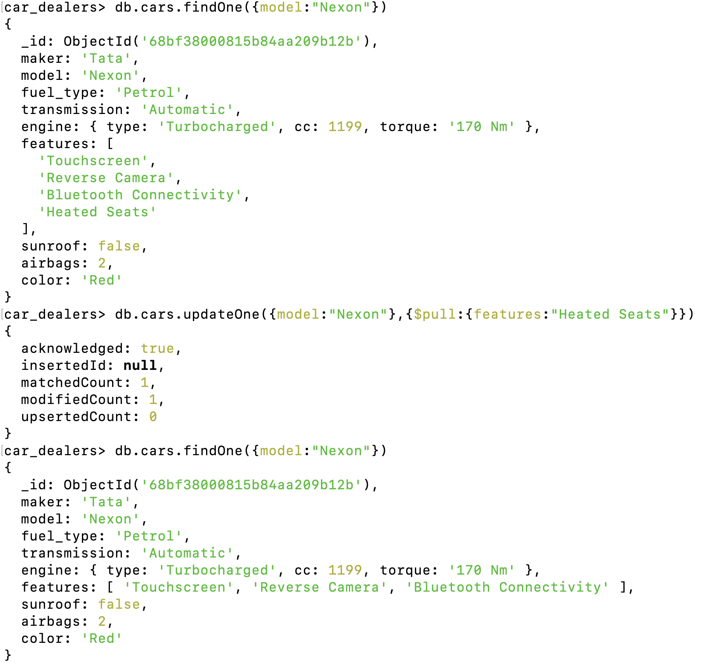

  5.  To `push multiple values at once` we need to use `$each`
      Note - `$each` only works with `$push` or `$addToSet`  
      `$push` with `$each` is a pre-defined operator - push multiple values

      Syntax

      ```js
      db.cars.updateOne(
        { model: "Nexon" }, // Filter to find the specific document
        {
          $push: {
            features: { $each: ["Wireless Charging", "Voice Control"] },
          },
        }
      );
      ```

        

  6.  To `pull multiple values at once` we need to use `$in`

      `$pull` with `$in` is a pre-defined operator - pull multiple values

      Syntax

      ```js
      db.cars.updateOne(
        { model: "Nexon" },
        { $pull: { features: { $in: ["Wireless Chargin", "Voice Control"] } } }
      );
      ```

        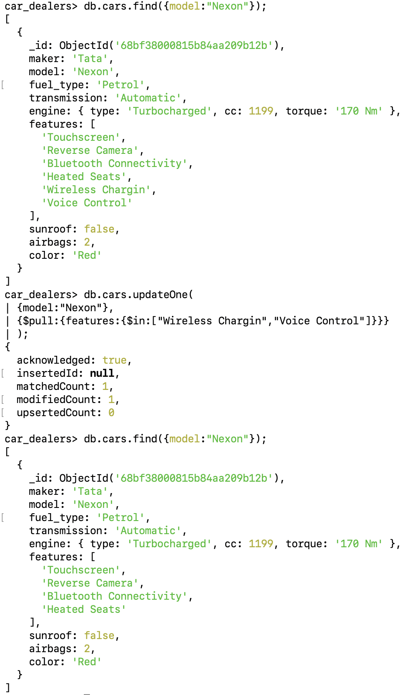

  7.  To `update - if present and insert - if not present`

      `$upsert` is a combination of the operations `"update"` and `"insert"`

      Syntax

      ```js
      db.students.updateMany(
        { name: "Jane Doe" },
        { $set: { age: 22, course: "Mathematics" } },
        { upsert: true }
      );

      db.cars.updateMany(
        { model: "Venue" },
        { $set: { maker: "Hyundai" } },
        { upsert: true }
      );
      ```

        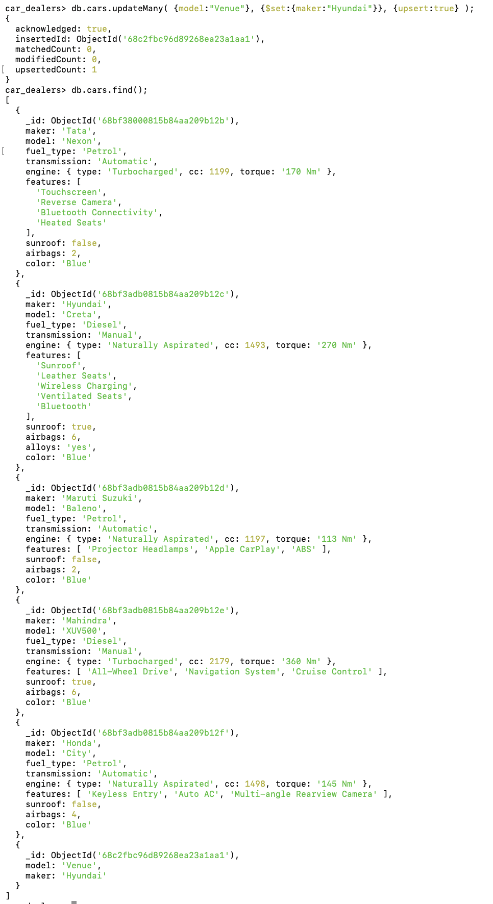

- updateMany()

  Syntax

  ```js
  db.cars.updateMany(
    { model: "Nexon" }, // Filter to find all documents where model is Nexon
    { $set: { fuel_type: "Electric" } } // update the fuel_type to Electric
  );

  db.cars.updateMany({}, { $set: { color: "Blue" } });
  ```

    

## 4. DELETE

Available Functions

- deleteOne() - to delete single document

  ```js
  db.cars.deleteOne({ fuel_type: "Petrol" });
  ```

    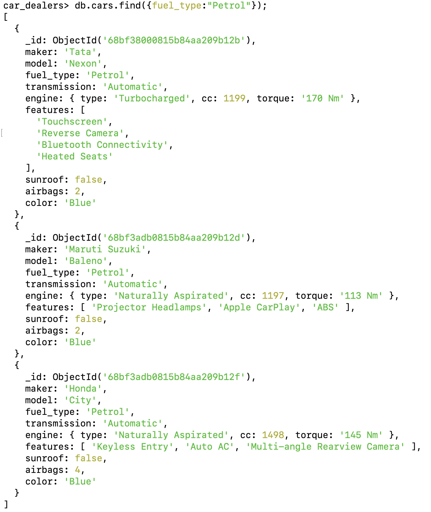
    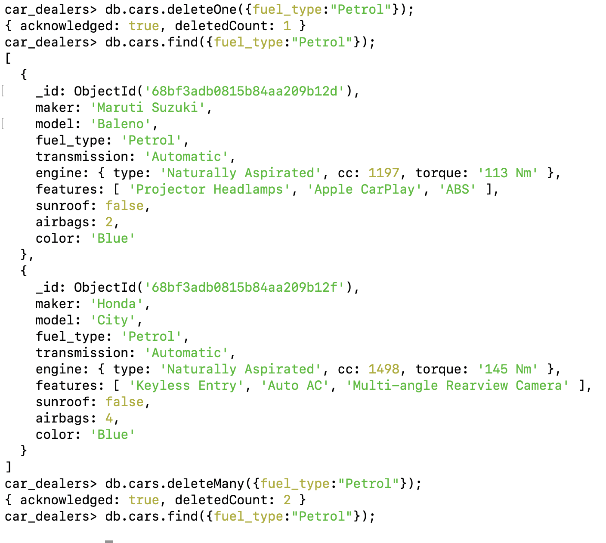

- deleteMany() - to delete multiple documents

```js
db.cars.deleteMany({});
```

### Use Case

Sample Car Data - [Link](https://www.youtube.com/redirect?event=video_description&redir_token=QUFFLUhqa2NHVU9MZElQR2ZudGlPN3lmWWdDT1V6cEpUUXxBQ3Jtc0trY0RmTVFiZUNMWFctT09VTHQ2MmVUZXUtLVRKNjlobUZQQ2VOUktkYk94VDktVFpGaWE4TzFWTHBHNDlHRm52MnAzVGhEM1djU1NaQmZFM1V1b1NreFl2aGpZM0RqZk5JdmotZDQ5SzJaTnVlNk41WQ&q=https%3A%2F%2Fwww.canva.com%2Fdesign%2FDAGNfeKTz_Q%2FnJB6OKFDJxFxiAxklMrVXw%2Fedit%3Futm_content%3DDAGNfeKTz_Q%26utm_campaign%3Ddesignshare%26utm_medium%3Dlink2%26utm_source%3Dsharebutton&v=tww-gbNPOcA)


Car dealing

- maker
- model
- fuel type
- transmission
- engine
  - cc
  - torque
- features
  - sunroof
  - airbags
