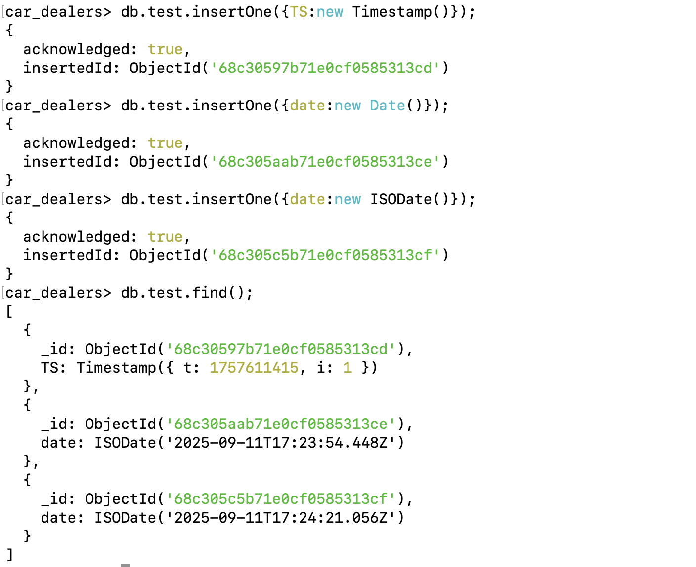

# Data Types - [Link](https://www.mongodb.com/docs/mongodb-shell/reference/data-types/)
- MongoDb stores data in [BSON (Binary JSON) format.](https://www.mongodb.com/docs/manual/reference/bson-types/)
- BSON includes all JSON datatypes and adds more.
- Choosing the correct datatype is essential for efficient storage and querying.

## Most Common Data Types

```js
_id: ObjectId("507slfkjj3j94jgvnr9u3123001801"),    // ObjectId
name: "John Doe",                                   // String
age: 30,                                            // Integer
price: 19.99,                                       // Double
isActive: true,                                     // Boolean
tags: ["mogodb","database","NoSQL"],                // Array
address: {                                          // Object/Embedded Document
    street: "123 Main St",
    city: "New York",
    state: "NY",
    zip: 10001
},
createAt: ISODate("2023-08-21T14:23:00Z"),          // Date
middleName: null,                                   // Null
ts: Timestamp(1638306013,1),                        // Timestamp
salary: Decimal128("12345.67"),                     // Decimal128 
```

Example

