# Operators - [Link](https://www.mongodb.com/docs/v6.0/reference/operator/)

## 1. Relational Operators - [Link](../03.%20Operators/query_operators.md)

`$eq` =, `$ne` !=, `$gt` >, `$gte` >=, `$lt` <, `$lte` <=, `$in` includes, `$nin` excludes

Example:

```js
{
  age: {
    $eq: 25;
  }
}
```

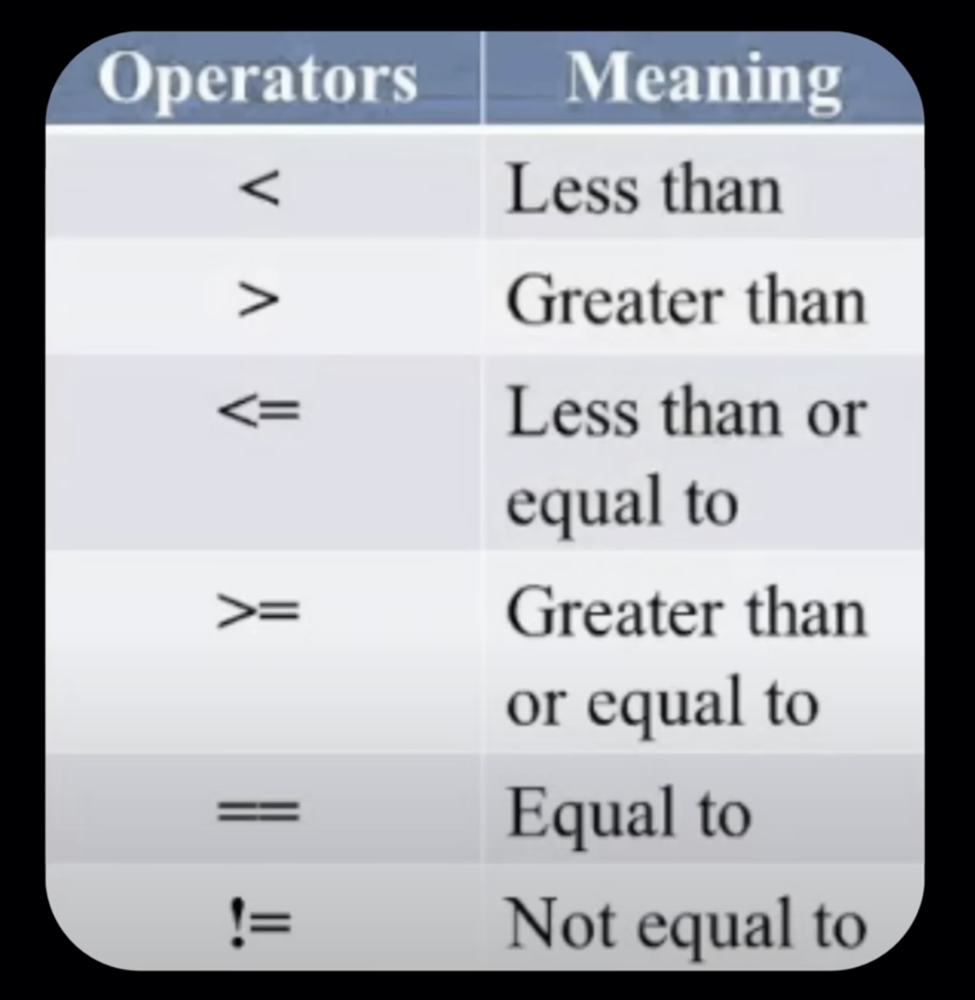

### Use Case1: Find the cars with engine more than 1400cc

1. `$gt`

   ```js
   db.cars.find({ "engine.cc": { $gt: 1400 } });
   ```

   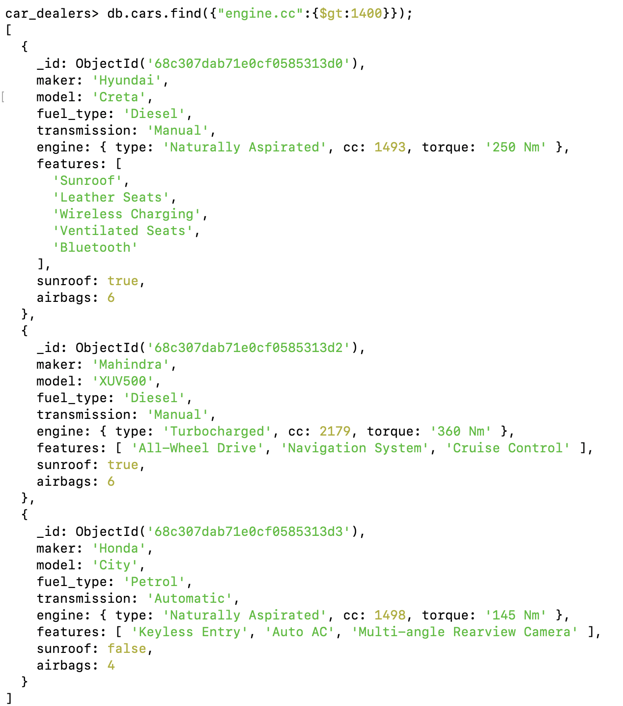

### Use Case2: Find the cars with engine having 1498cc and 2179cc

2. `$in`

   Here we are trying to search based on multiple values

   ```js
   db.cars.find({ "engine.cc": { $in: [1498, 2179] } });
   ```

   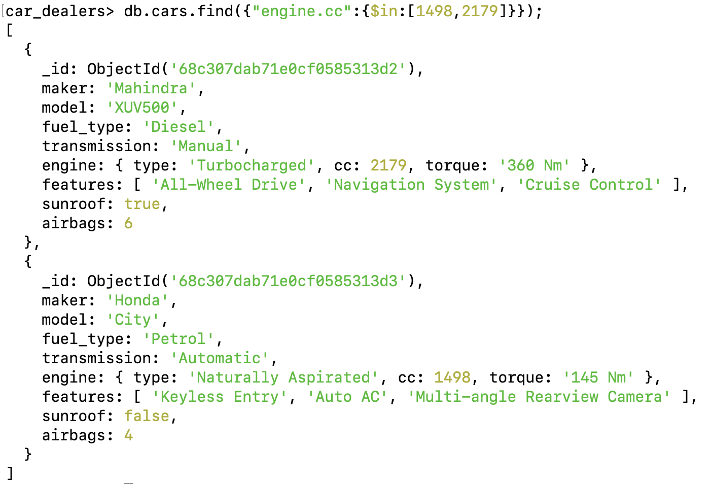

---

## 2. Logical Operators - [Link](../03.%20Operators/query_operators.md)

`$and` both conditions should be true  
`$or` either or both condition should be true  
`$nor` neither condition should be true  
`$not` negates the result

### Use Case3: I want a car which is Diesel, Sunroof & TurboCharged Engine

- Car with all these features

  ```js
  db.cars.find({
    $and: [
      { fuel_type: "Diesel" },
      { "engine.type": "Turbocharged" },
      { suroof: true },
    ],
  });
  ```

  Use Case

    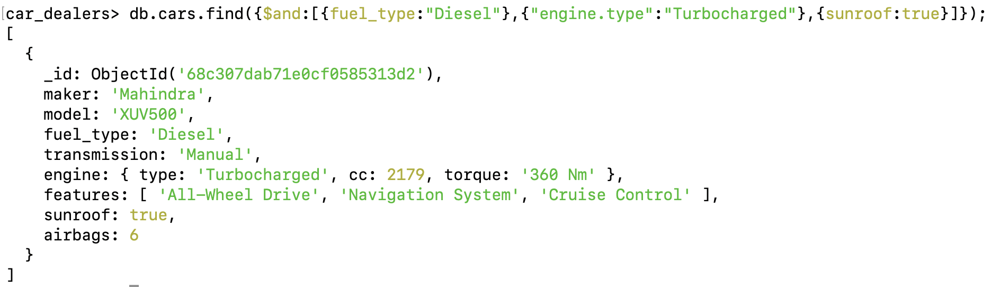

1.  `$and` - Car with diesel and turbocharged features

    ```js
    db.cars.find({
      $and: [{ fuel_type: "Diesel" }, { "engine.type": "Turbocharged" }],
    });
    ```

    And Operator

    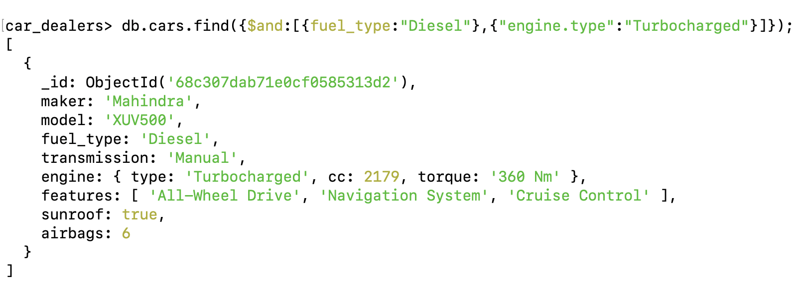

2.  `$or` - I want a with either Automatic or sunroof or both will work

    ```js
    db.cars.find({ $or: [{ transmission: "Automatic" }, { sunroof: true }] });
    ```

    Or Operator

    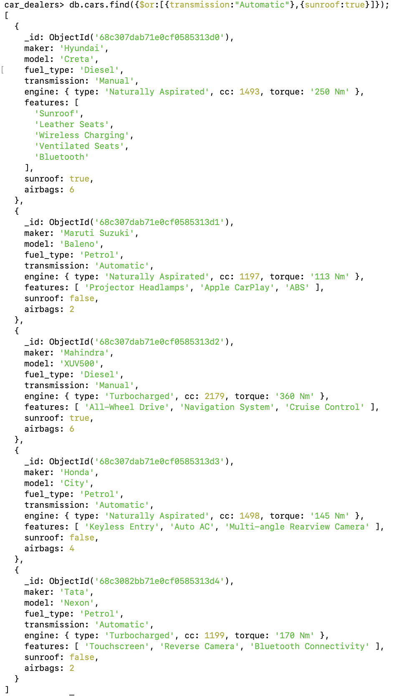

3.  `$nor` - I don't want a car with either Manual or less than 4 airbags

    ```js
    db.cars.find({
      $nor: [{ transmission: "Manual" }, { airbags: { $lt: 4 } }],
    });
    ```

    Nor Operator

    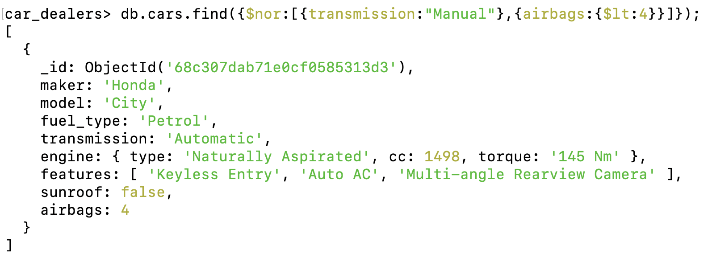

4.  `$not` - I don't want car with less than 4 airbags

    ```js
    db.cars.find({ airbags: { $not: { $lt: 4 } } });
    ```

    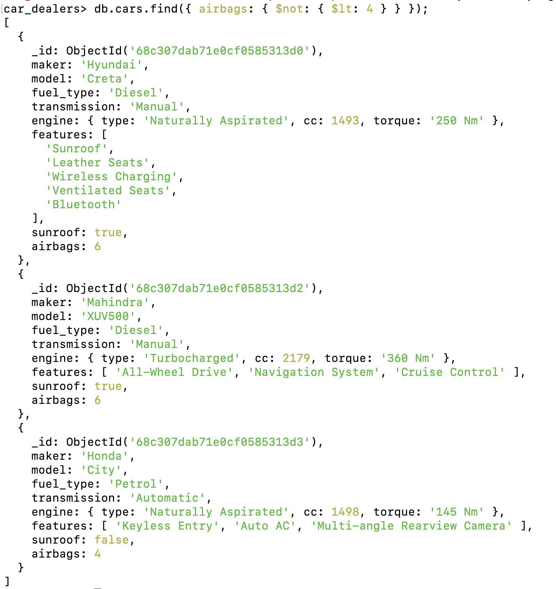

---

## 3. Element Operators - [Link](../03.%20Operators/query_operators.md)

1. `$exists` - Checks if field exists

   ```js
   db.cars.find({ age: { $exists: true } });
   db.cars.find({ fuel_type: { $exists: true } });
   ```

   Check field fuel_type exists

   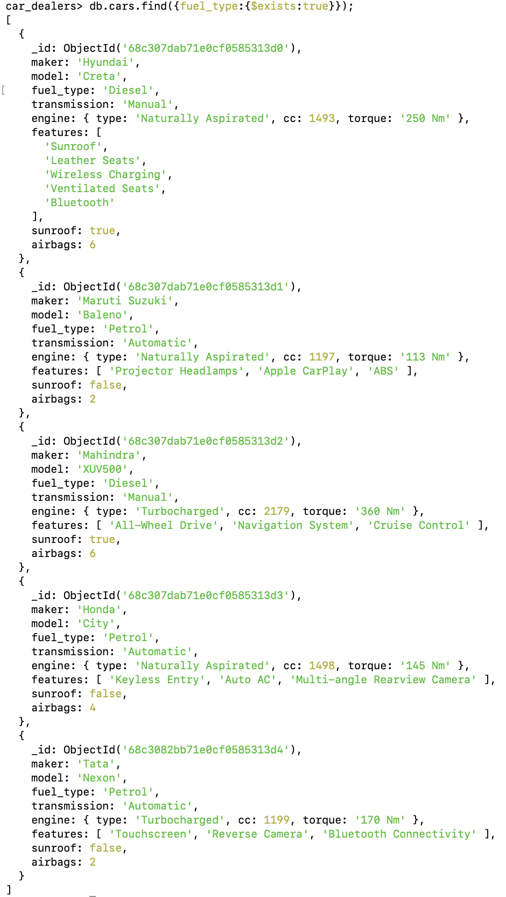
    
    Check field color exists

   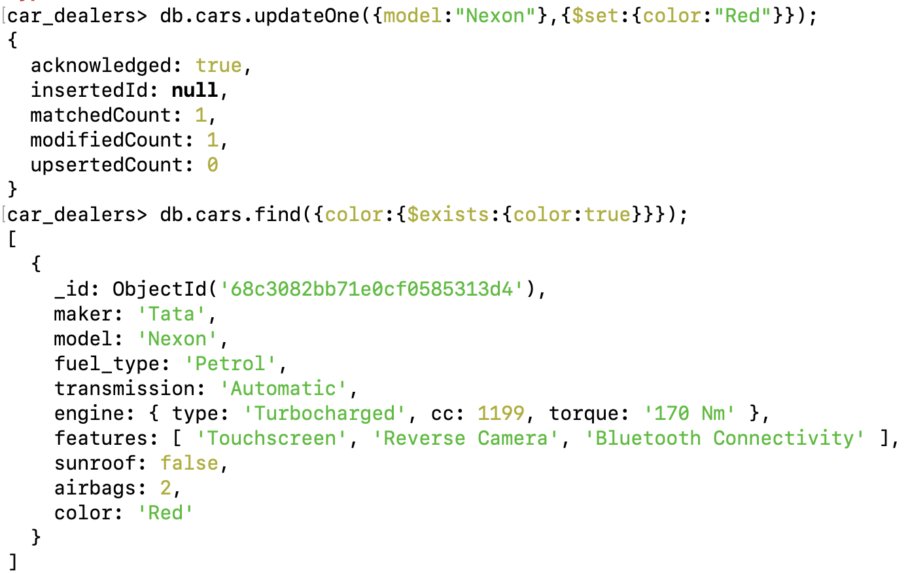

2. `$type` - Matches fiel by BSON type

   - here we can filter the content based on BSON type like string, bool, etc
   - this can be useful to find field with null values

   ```js
   db.cars.find({ name: { $type: "string" } });
   ```

    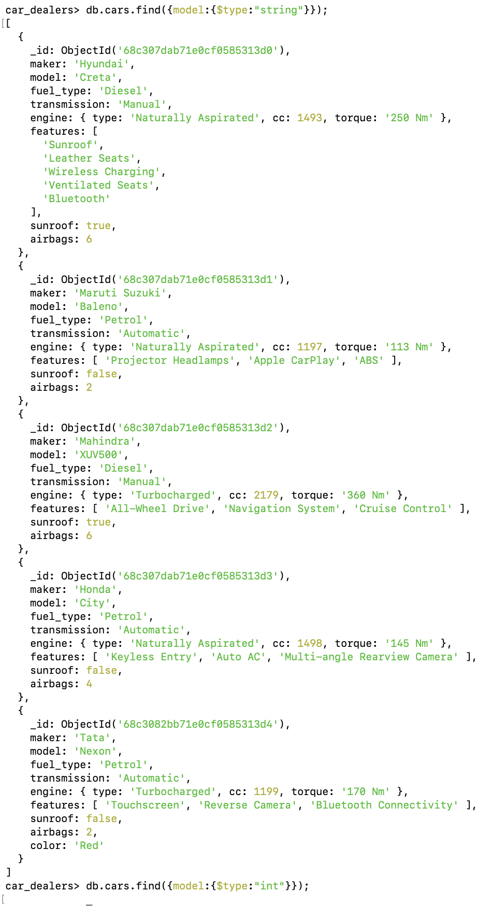

## 4. Array Operators - [Link](../03.%20Operators/query_operators.md)

1. `$all`

   - Matches array containing all the elements

   ```js
   {
     tags: {
       $all: ["red", "blue"];
     }
   }
   ```

   ```js
   db.cars.find({ features: { $all: ["Bluetooth", "Sunroof"] } });
   ```

   Matches docs where tags contain both red & blue

   Multiple Parameters  
   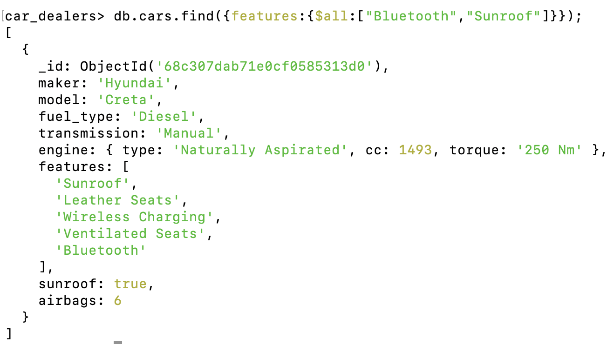

   Single Parameters  
    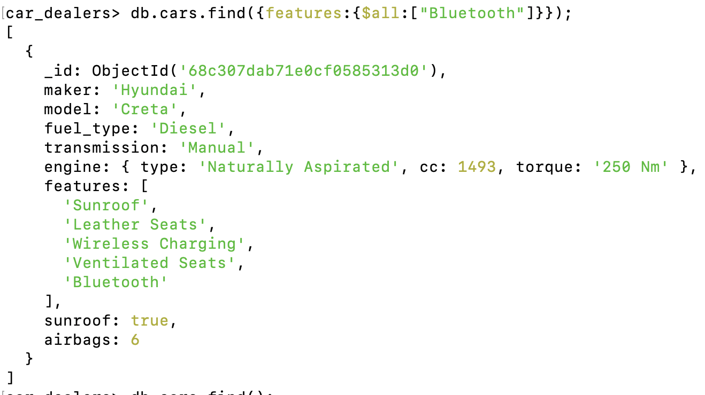

2. `$size`

   - Matching array with the length of the array

   ```js
   {
     tags: {
       $size: 3;
     }
   }
   ```

   ```js
   db.cars.find({ features: { $size: 5 } });
   ```

   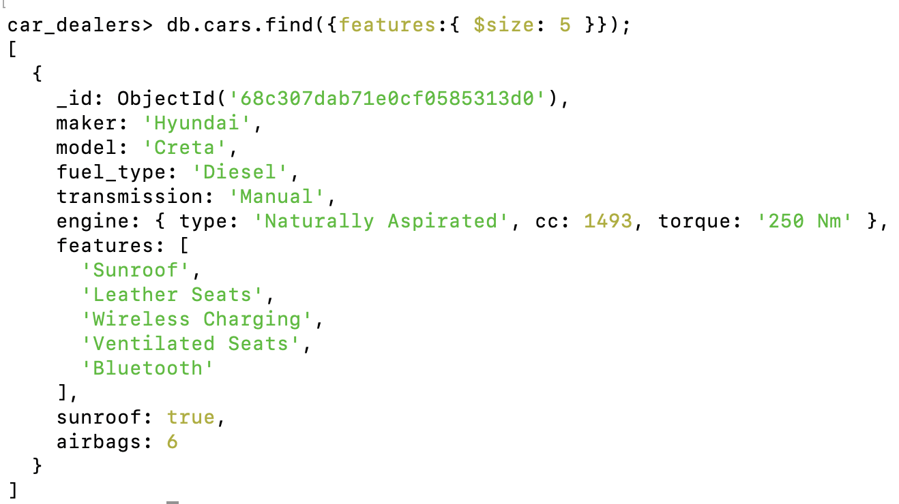

   - Matches arrays with exactly 3 elements

3. `$elemMatch`

   - Matches element which satisifies condition

   ```js
   { scores: { $elemMatch: { $gt: 80, $lt: 100 } } }
   ```

   - Matches docs with a score between 80 and 100
