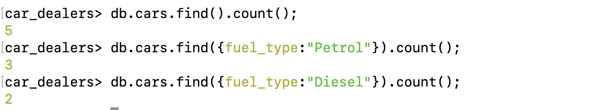
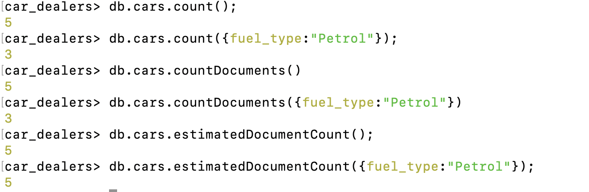
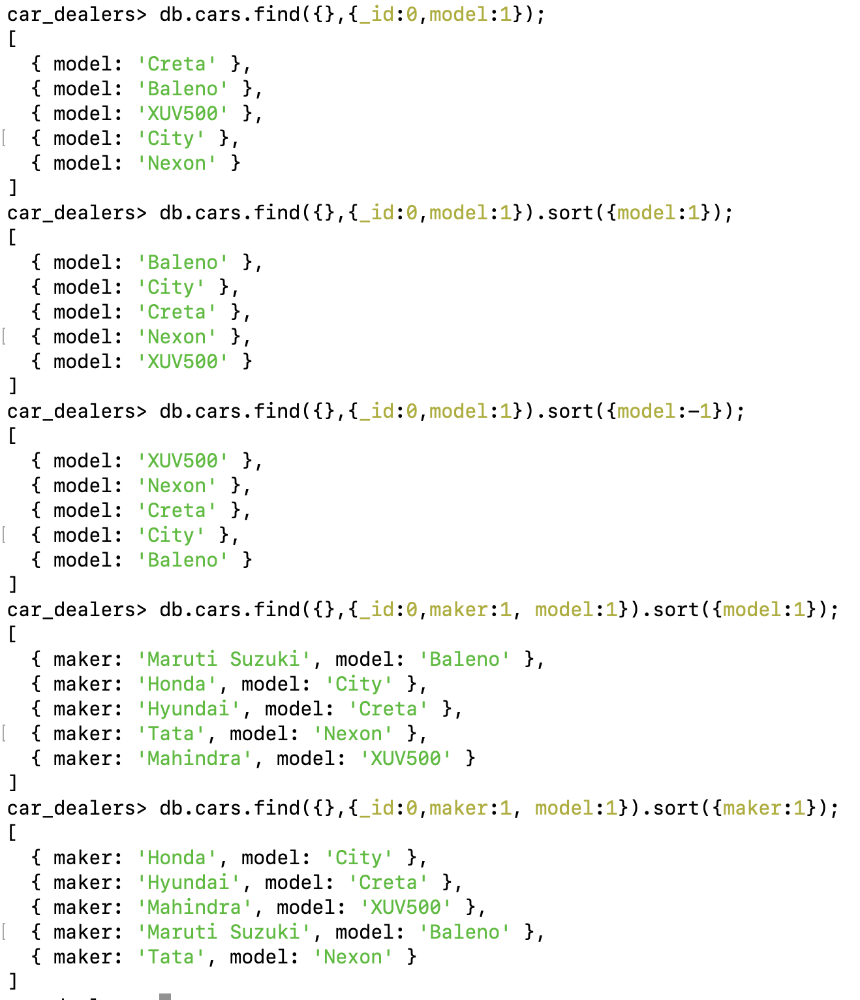
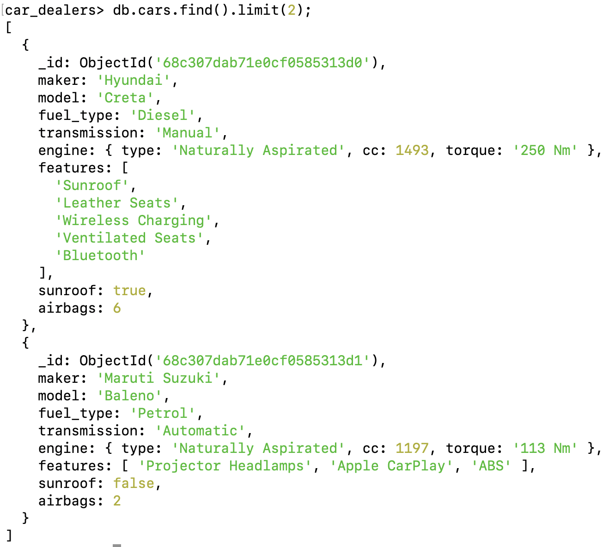
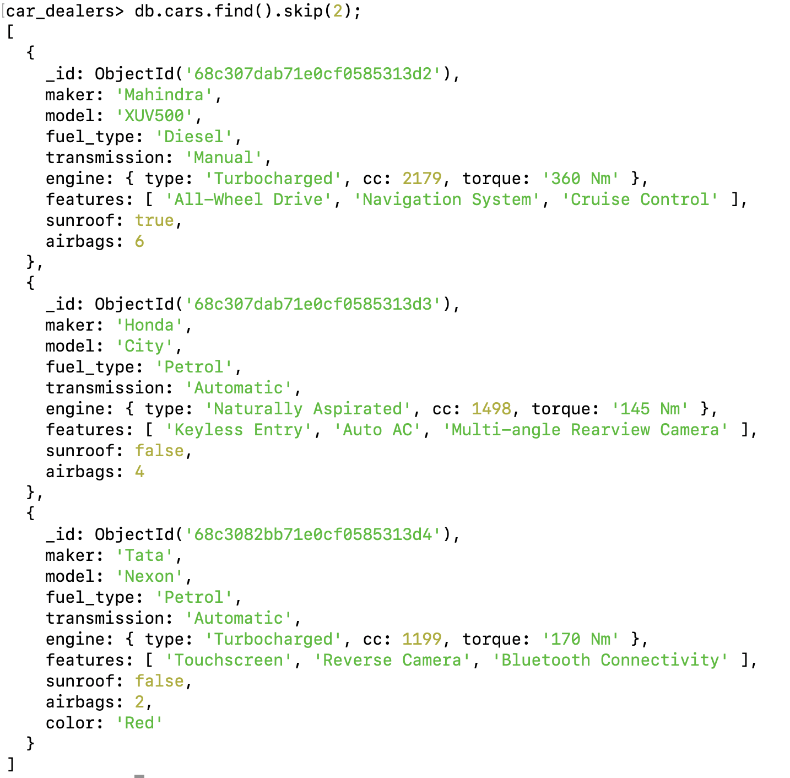

# Cursor Methods

- Count

  - `find().count()` // this will get deprecated or removed form mongodb because it gives inaccurate results some times

  `Instead use these`

  - `countDocuments()` // accurate but slower
  - `estimatedDocumentCount()` // it gives estimation not much of accurate but better than count, does not support querying

    - NOTE - checkout this file for more details on count - [Link](./07.%20Count.md)

    1. `only count is cursor method` among all count methods
    2. countDocuments() is a collection level method
    3. estimatedDocumentCount() is also a collection level method
    4. $count is an aggregate function

- Sort
  - `find().sort({"name":1})` // 1 for ascending and -1 is for descending order
- Limit
  - `find().limit(2)`
- Skip
  - `find().skip(3)`

### Use Case: How to find no. of records/documents?

1. Count functions - count documents based on query

   ```js
   db.cars.count();
   db.cars.count({ fuel_type: "Petrol" });
   db.cars.countDocuments();
   db.cars.countDocuments({ fuel_type: "Petrol" });
   db.cars.estimatedDocumentCount();
   db.cars.estimatedDocumentCount({ fuel_type: "Petrol" }); // in this querying does not work it gives wrong result
   ```

   
   

2. Sort - sort documents based on the selected field

   ```js
    db.cars.find({},{_id:0,model:1}).sort({model:1}); // ascending order
    db.cars.find({},{_id:0,model:1}).sort({model:-1}); // descending order
    db.cars.find({},{_id:0,maker:1,model:1}).sort({model:-1}); // ascending order based on model
    db.cars.find({},{_id:0,maker:1,model:1}).sort({maker:-1}); // ascending order based on maker
   ```

   

3. Limit - the number of document you want to see from starting
    ```js
    db.cars.find().limit(2);
    ```

   

4. Skip - to skip the starting documents and see afterwards
    ```js
    db.cars.find().skip(2);
    ```

   
