# Aggregate Framework

Aggregation is a powerful framework for complex operations

like filtering, grouping, sorting, reshaping, and summarizing data in a flexible way via pipeline.

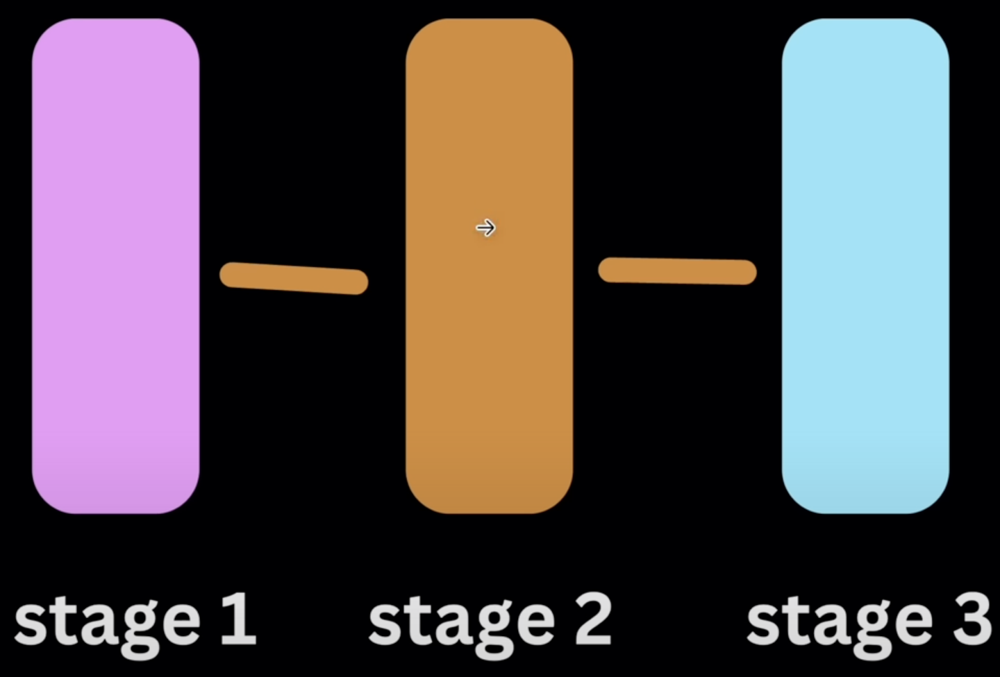

Syntax

```js
db.collection.aggregate([
    {stage1},
    {stage2}...
],{option})
```

Example

```js
db.orders.aggregate([
  // stage 1: Filter pizza order documents by pizza size
  {
    $match: { size: "medium" },
  },

  // stage 2: Group remaining documents by pizza name and calculate total quantity
  {
    $group: { _id: "$name", totalQuantity: { $sum: "quantity" } },
  },
]);
```

# Most commonly used stages in MongoDB aggregation:

- $match → Filters documents (like find)
- $group → Groups documents and applies accumulators
- $project → Controls which fields to show
- $sort → Sorts documents
- $limit → Restricts number of results
- $sortByCount → Groups + counts + sorts in one step
- $unwind → Deconstructs arrays into multiple docs
- $lookup → Performs join between collections
- $addFields → Adds or modifies fields
- $count → Counts number of documents
- $skip → Skips certain number of documents
- $out → It writes the result of the aggregation pipeline to a new (or existing) collection.

---

`
`

---

## 1. Group stage

Purpose → Group documents by a field and perform aggregate calculations.

Sytanx

```js
db.collection.aggregate([
  {
    $group: {
      _id: "$category", // Group documents by the "category" field.
      // The `$` symbol means "use the value of this field".

      totalAmount: { $sum: "$amount" }, // Sum of "amount" for each category.
      averageAmount: { $avg: "$amount" }, // Average of "amount" for each category.
      minAmount: { $min: "$amount" }, // Minimum "amount" value in the group.
      maxAmount: { $max: "$amount" }, // Maximum "amount" value in the group.

      amountList: { $push: "$amount" }, // Creates an array of ALL "amount" values in the group.
      uniqueAmounts: { $addToSet: "$amount" }, // Creates an array of UNIQUE "amount" values only.
    },
  },
]);
```

### 🔑 Key Notes:

- \_id inside $group → defines the grouping key. Here, all docs with the same category value will be grouped together.
- Accumulator operators like $sum, $avg, $min, $max, $push, $addToSet → define how values inside each group are aggregated.
- $push vs $addToSet:

  - $push → keeps duplicates, preserves all values.
  - $addToSet → removes duplicates (acts like a set).

    `Data has been grouped on the basis of these makers`
    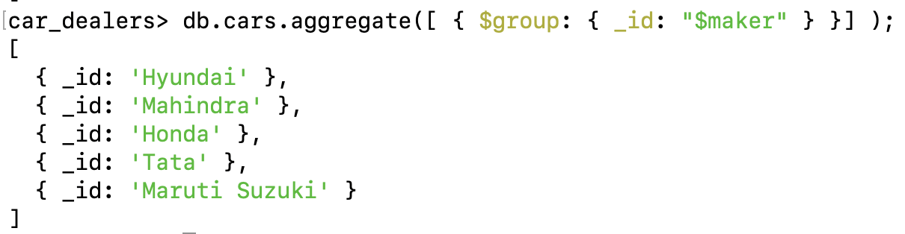

### Use Case: Find no. of cars of each brand (we have to group)

```js
db.cars.aggregate([{ $group: { _id: "$maker", TotalCars: { $sum: 1 } } }]);
// The $sum:1 operation counts the number of documents in each group.
// we are using 1 here because $sum adds values and since we are counting number of documents each document == 1 document
```

Grouping maker  


Counting Total Cars available in Grouped Data based on makers  
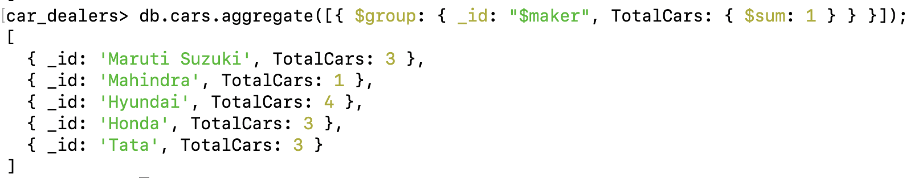

Grouped data operations  
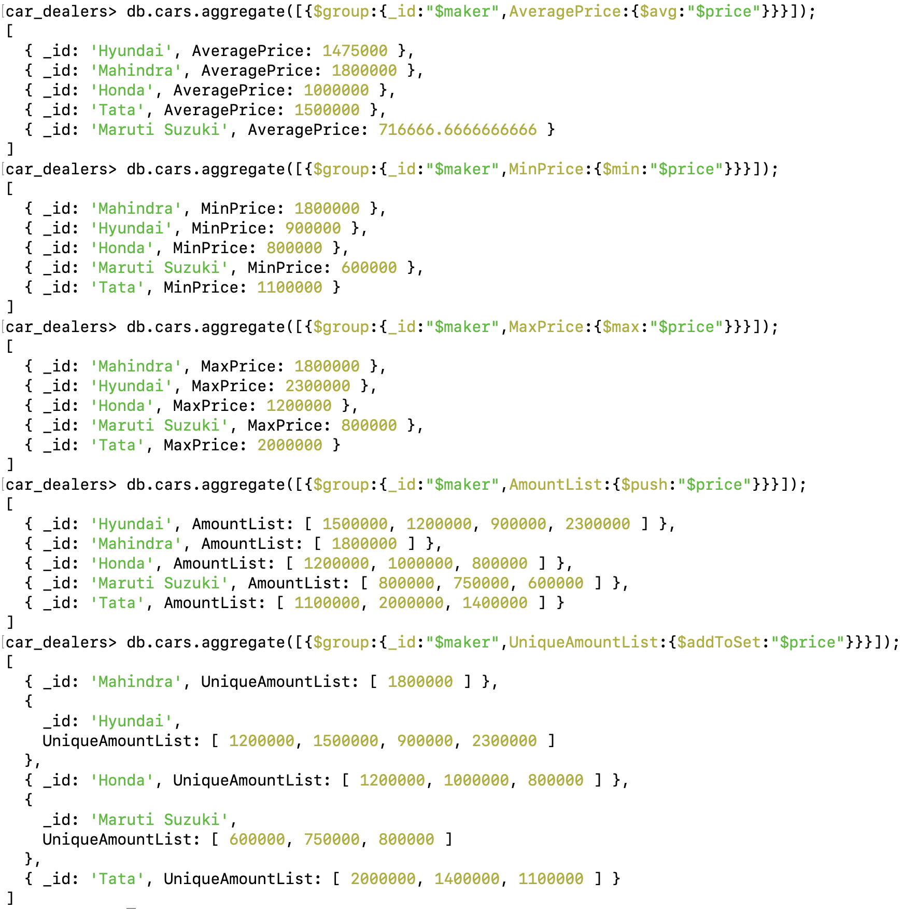

### Use Case: Find no. of cars of different fuel_type

```js
db.cars.aggregate([{ $group: { _id: "$fuel_type", TotalCars: { $sum: 1 } } }]);
```

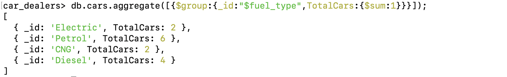

---

`
`

---

## Match State

Purpose → Filter documents before further processing.

### Use Case: Hyundai cars having engine of more than 1200cc

```js
db.cars.aggregate([
  { $match: { maker: "Hyundai", "engine.cc": { $gt: 1200 } } },
]);
```

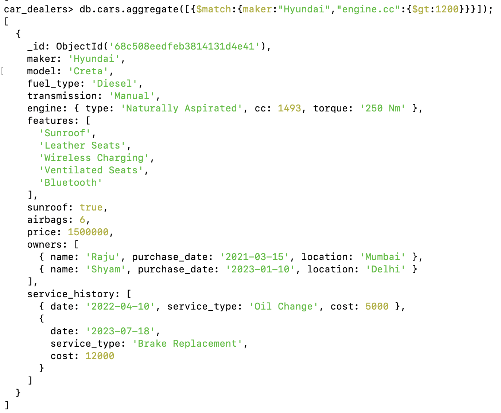

---

`
`

---

## Count Stage

Purpose → Returns a count of documents that match a filter.

### Use Case: Print Total no. of Hyundai Cars

```js
db.cars.aggregate([
  { $match: { maker: "Hyundai" } }, // stage 1 which is match - will find all cars with maker hyundai
  { $count: "Total_cars" }, // stage 2 this will get operated on the result match gives - will count total_cars
]);
```

### Use Case2: Count no. of diesel and petrol cars of Hyundai brand

```js
// This groups all the hyundai cars according to there fuel_type
db.cars.aggregate([
  { $match: { maker: "Hyundai" } },
  { $group: { _id: "$fuel_type", Total_cars: { $sum: 1 } } },
]);

// This groups all hyundai cars but only petrol and diesel fuel_type
db.cars.aggregate([
  { $match: { maker: "Hyundai", fuel_type: { $in: ["Petrol", "Diesel"] } } },
  { $group: { _id: "$fuel_type", Total_cars: { $sum: 1 } } },
]);
```

Solution for both use cases of count  
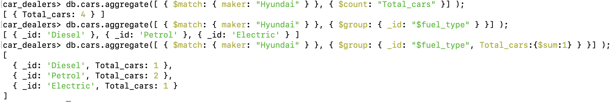

Precise solution for use case 2
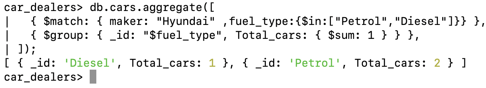

---

`
`

---

## Project Stage - works as projection

Purpose → Show only specific fields (projection).

### Use Case: Find all the Hyundai cars and only show Maker, Model and Fuel_type details

```js
db.cars.aggregate([
  { $match: { maker: "Hyundai" } },
  { $project: { _id: 0, maker: 1, model: 1, fuel_type: 1 } },
]);
```

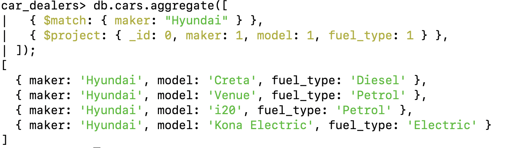

---

`
`

---

## Sort Stage

Purpose → Sort documents by fields.

### Use Case: For the previous output, sort the data based on model

```js
db.cars.aggregate([
  { $match: { maker: "Hyundai" } },
  { $project: { _id: 0, maker: 1, model: 1, fuel_type: 1 } },
  { $sort: { model: 1 } }, // 1 for ascending, -1 for descending
]);
```

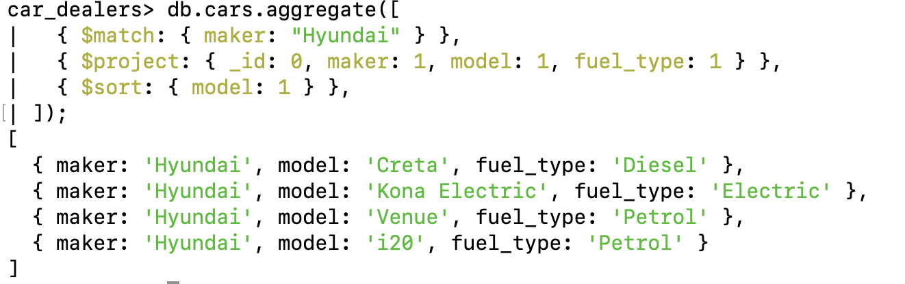

NOTE -

- wondering why i20 is at last - because sorting happens based on ascii values and small alphabets start after big alphabets

---

`
`

---

## sortByCount Stage

Purpose → Group documents by a field, count them, and sort by count (shortcut).

### Use Case: Group the car by Maker and then sort based on count (no. of cars)

Purpose → Breaks an array field into multiple documents.

```js
db.cars.aggregate({ $sortByCount: "$maker" });
```

---

`
`

---

## Unwind Stage

### Use Case: We do havve multiple owners for each car right (owners are list of documents), now if you want to work on each owner then we can use unwind

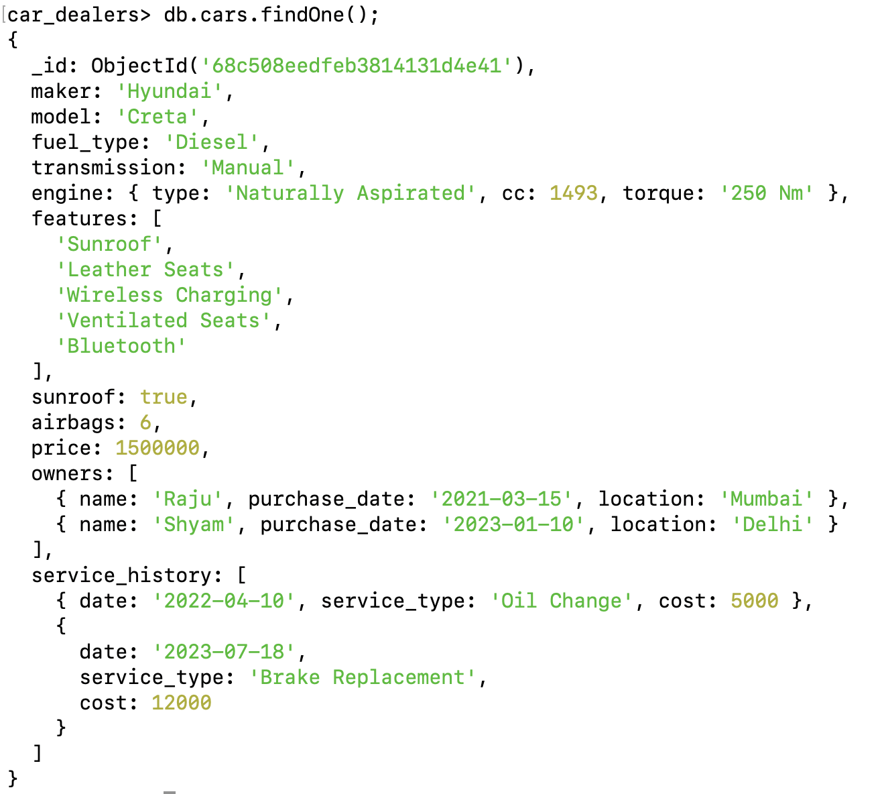

```js
db.cars.aggregate([{ $unwind: "$owners" }]);
```

here we have separated owner and created document for every single owner

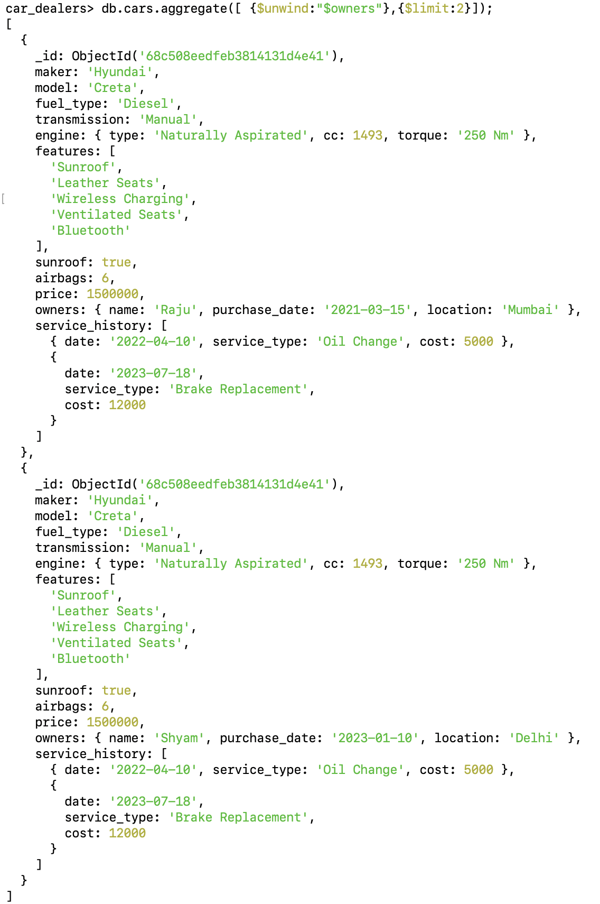

---

`
`

---

## Limit Stage - use to print result from starting to the value assigned like starting 3 documents

Purpose → Restrict number of results.

### Use Case: Find average price of vehicles and then sort them in decreasing order then find top 3 costly vehicles

```js
db.cars.aggregate([
  { $group: { _id: "$maker", AveragePrice: { $avg: "$price" } } },
  { $sort: { AveragePrice: -1 } },
  { $limit: 3 },
]);
```

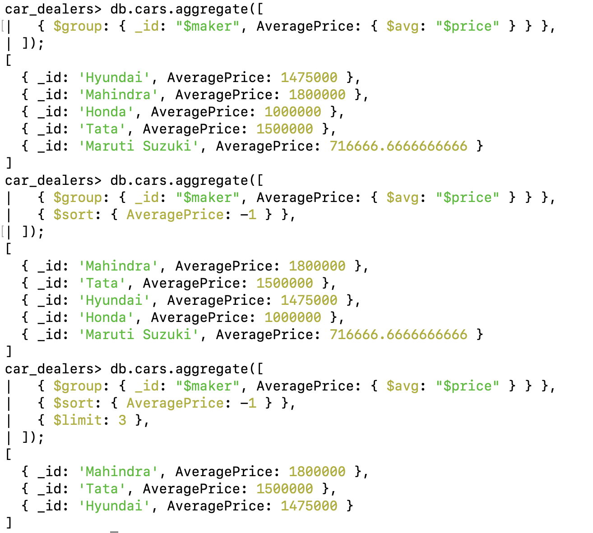

---

`
`

---

## Skip Stage - use to skip result from starting to the value provided

Purpose → Skip first N results.

### Use Case: Find average price of vehicles and then sort them in ascending order then skip top 2 vehicles

```js
db.cars.aggregate([
  { $group: { _id: "$maker", AveragePrice: { $avg: "$price" } } },
  { $sort: { AveragePrice: 1 } },
  { $skip: 2 },
]);
```

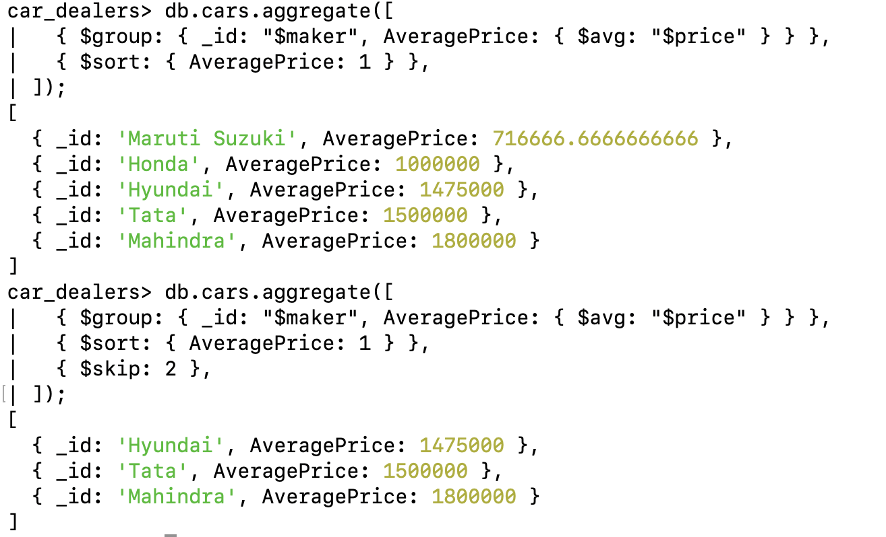

---

`
`

---

## $addFields Stage

#### ✅ Purpose

- Adds new fields or modifies existing ones in the documents passing through the pipeline.
- Similar to $project, but instead of reshaping the document, it adds fields while keeping the rest unchanged.

Syntax

```js
{
  $addFields: {
    newField: <expression>,
    existingField: <expression>
  }
}
```

Example

```js
db.cars.aggregate([
  {
    $addFields: {
      fullName: { $concat: ["$maker", " ", "$model"] }, // combine fields
      isElectric: { $eq: ["$fuel_type", "Electric"] }, // boolean flag
    },
  },
]);
```

`These fullName and isElectric field got added in every document`

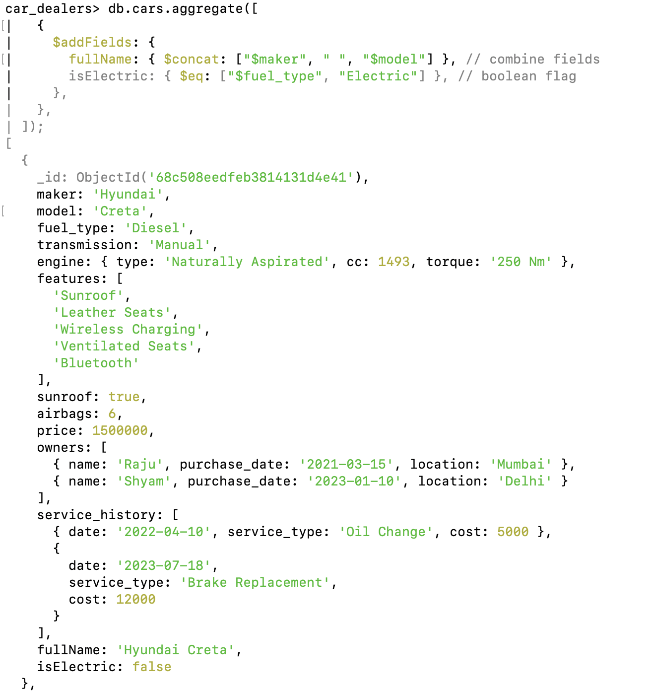

### Use Case: Print details of cars with price in lakhs (15 lakhs)

```js
db.cars.aggregate([
  { $project: { model: 1, _id: 0, price: 1 } },
  {
    $addFields: {
      price_in_lakhs: {
        // $toString converts the double into string, since we can only concat string we must convert double to string in order to get this result
        $concat: [{ $toString: { $divide: ["$price", 100000] } }, " lakhs"],
      },
    },
  },
]);
```

Solution of this use case
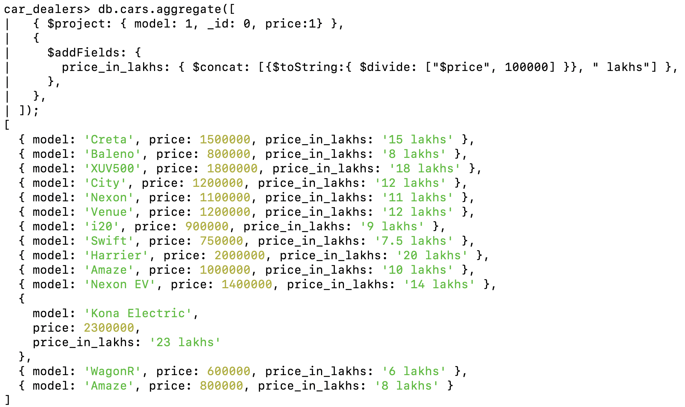

Value when divided and have so many decimal places (double data type)
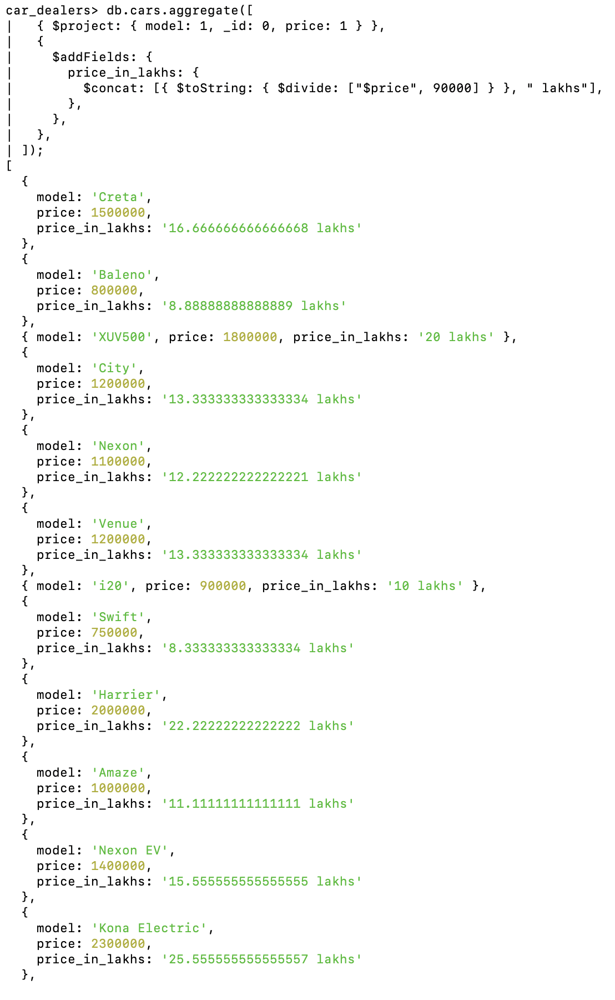

To handle these decimals by using `$round()` arithmetic operator
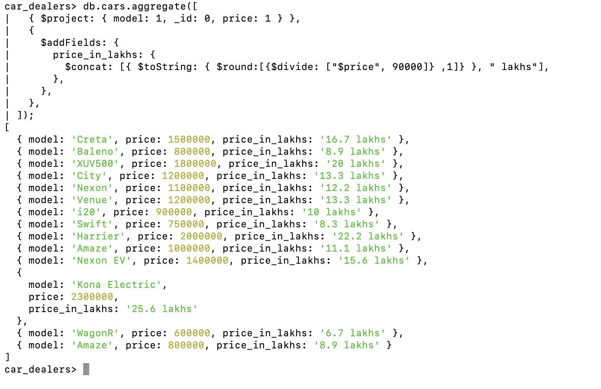


#### 📝 Notes

- Good for derived fields.
- Doesn’t remove existing fields.
- Can be replaced by $project if you want to control which fields remain.

---

`
`

---

## $lookup Stage

#### ✅ Purpose

- Performs a left outer join between two collections.
- Lets you merge related data from another collection into your pipeline.

Syntax

```js
{
  $lookup: {
    from: "<foreign_collection>",
    localField: "<field_in_current_collection>",
    foreignField: "<field_in_foreign_collection>",
    as: "<output_array_field>"
  }
}
```

Let's create a new collection `dealers` to understand it better

`Collection dealer`

```js
db.dealers.insertMany([
  { dealer_id: 1, location: "Mumbai", dealer_name: "Hyundai Mumbai Central" },
  { dealer_id: 2, location: "Delhi", dealer_name: "Maruti Delhi South" },
  { dealer_id: 3, location: "Bangalore", dealer_name: "Tata Bangalore West" },
]);
```

`Now join cars with dealers based on owners’ location 👇`

```js
db.cars.aggregate([
  {
    $lookup: {
      from: "dealers", // foreign collection
      localField: "owners.location", // owners' location from cars
      foreignField: "location", // location in dealers
      as: "dealerInfo", // new field
    },
  },
  {
    $project: {
      maker: 1,
      model: 1,
      "owners.name": 1,
      "owners.location": 1,
      dealerInfo: 1,
    },
  },
]);
```

`✅ Example Output (for Hyundai Creta with owner in Mumbai):`

```js
{
  maker: "Hyundai",
  model: "Creta",
  owners: [
    { name: "Raju", location: "Mumbai" },
    { name: "Shyam", location: "Delhi" }
  ],
  dealerInfo: [
    { dealer_id: 1, location: "Mumbai", dealer_name: "Hyundai Mumbai Central" },
    { dealer_id: 2, location: "Delhi", dealer_name: "Maruti Delhi South" }
  ]
}
```

This example output got created for every car
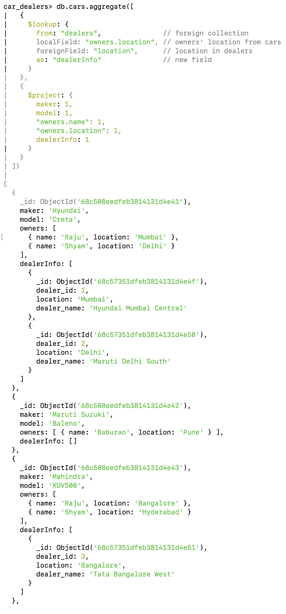

#### 📝 Notes

- Performs left outer join between collections.
- Merges related documents into an array.
- Can also be extended with pipeline syntax for filtering and projecting join results.

---

`
`

---

## $out Stage

#### 🔹 What $out Does

- It writes the result of the aggregation pipeline to a new (or existing) collection.
- Effectively, it takes the final output of the pipeline and stores it permanently instead of just returning it.

Syntax

```js
db.collection.aggregate([
  { <stages...> },
  { $out: "targetCollectionName" }
])
```

Example

```js
db.cars.aggregate([{ $match: { maker: "Hyundai" } }, { $out: "hyundaiCars" }]);
```

Now if you run

```js
db.hyundaiCars.find();
```

👉 You’ll see only Hyundai cars stored in that new collection.

#### 🔑 Notes

- $out overwrites the target collection if it already exists.
- If you want to merge instead of overwrite, use $merge (introduced in MongoDB 4.2).
- $out must be the last stage in the pipeline.

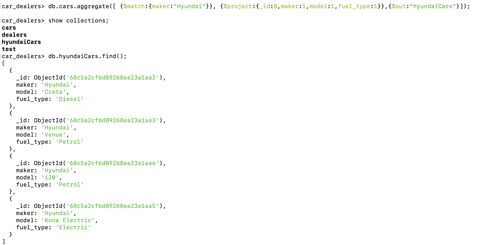

### Use Case: After aggregating, store the result in an another collection 'hyundai_cars'

```js
db.cars.aggregate([
  { $match: { maker: "Hyundai" } },
  { $project: { _id: 0, CarName: { $concat: ["$maker", " ", "$model"] } } },
  { $out: "hyundai_cars" },
]);
```

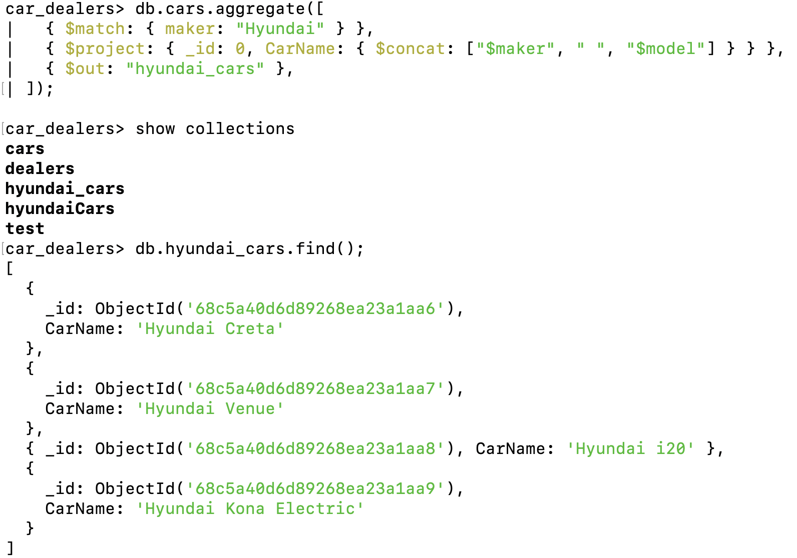
