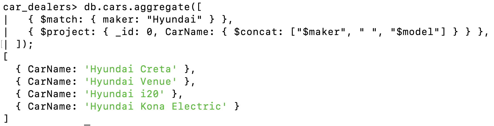
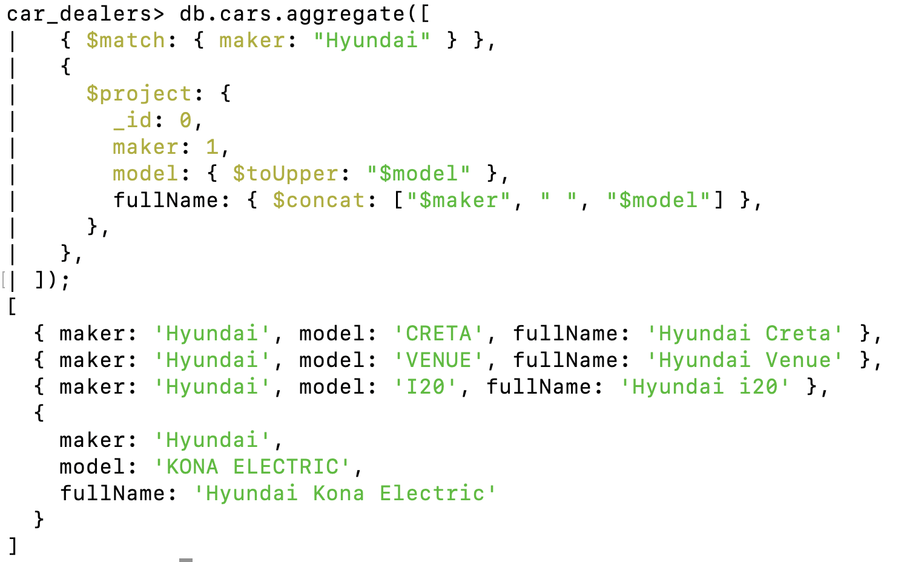
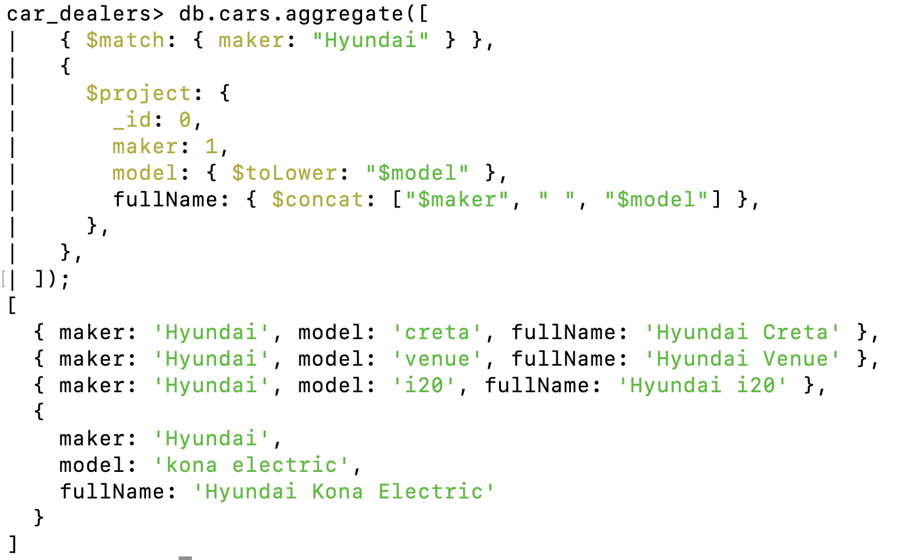
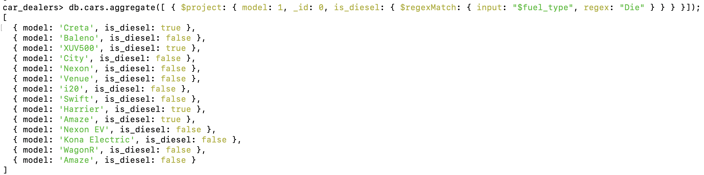

# String Operators

- $concat → Joins (concatenates) two or more strings into one.
- $toUpper → Converts a string to uppercase.
- $toLower → Converts a string to lowercase.
- $regexMatch → Checks if a string matches a given regular expression (returns boolean).
- $ltrim → Removes leading whitespace/characters from the start of a string.
- $split → Splits a string into an array based on a given delimiter.

## 1. concat

Syntax

```js
db.collections.aggregate([
  { project: { fullName: { $concat: ["firstName", " ", "lastName"] } } },
  // concatenate firstName and lastName with a space
]);
```

### Use Case: List down all the Hyundai cars and print the name as Maker + Model i.e. CarName Hyundai Create

```js
db.cars.aggregate([
  { $match: { maker: "Hyundai" } },
  { $project: { _id: 0, CarName: { $concat: ["$maker", " ", "$model"] } } },
]);
```



---

```

```

---

## toUpper

Syntax

```js
db.collections.aggregate([
  { project: { $toUpper: "$field" } },
  // concatenate firstName and lastName with a space
]);
```

### Use Case: List down all the Hyundai cars and print the name as Maker + Model i.e. CarName Hyundai Create and maker should be in upperCase

```js
db.cars.aggregate([
  { $match: { maker: "Hyundai" } },
  {
    $project: {
      _id: 0,
      maker: 1,
      model: { $toUpper: "$model" },
      fullName: { $concat: ["$maker", " ", "$model"] },
    },
  },
]);
```



---

```

```

---

## toLower

Syntax

```js
db.collections.aggregate([
  { project: { $toLower: "$field" } },
  // concatenate firstName and lastName with a space
]);
```

### Use Case: List down all the Hyundai cars and print the name as Maker + Model i.e. CarName Hyundai Create and maker should be in lowerCase

```js
db.cars.aggregate([
  { $match: { maker: "Hyundai" } },
  {
    $project: {
      _id: 0,
      maker: 1,
      model: { $toLower: "$model" },
      fullName: { $concat: ["$maker", " ", "$model"] },
    },
  },
]);
```



---

```

```

---

## regexMatch - [Link](./10.%20Important_Regex_Expression.md)

Syntax

```js
{
    $regexMatch:{
        input:<string_expression>,
        regex:<regex_pattern>,
        options:"<options>" // optional, e.g. "i" for case-insensitive, if you want to ignore case-sensitivity use "i"
    }
}
```

Performs a regular expression (regex) pattern matching and returns true or false.

### Use Case: Add a flag is_diesel=true/false for each car

```js
db.cars.aggregate([
    {$project:{
        model:1,
        _id:0,
        is_diesel:{
                $regexMatch:{{input:"$fuel_type",regex:"Die"}}  // regex checks pattern so either you could write full name of diesel or some characters
            }
        }
    }
]);
```



---

```

```

---
