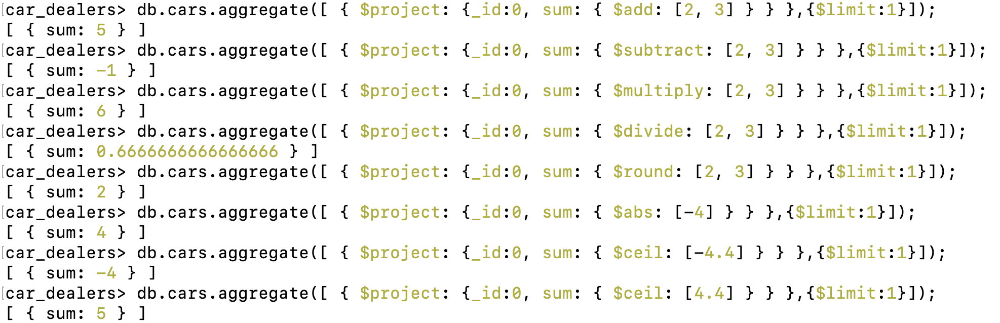
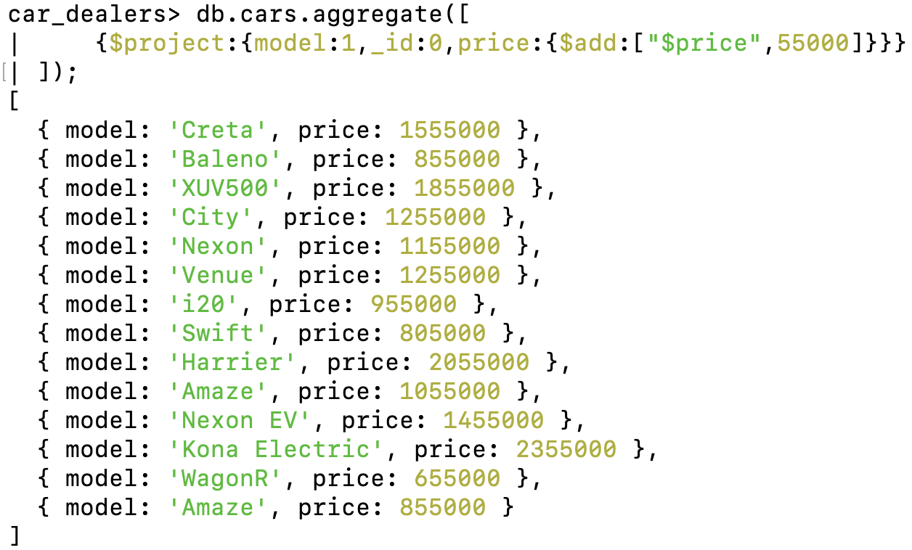
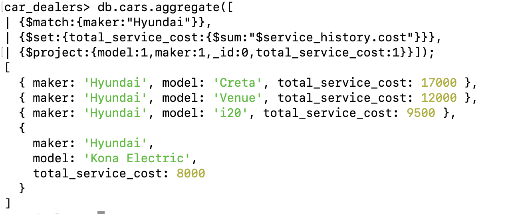

# Arithmetic Operators - [Link](https://www.mongodb.com/docs/manual/reference/mql/expressions/)

- $add
- $subtract
- $divide
- $multiply
- $round
- $abs
- $ceil

Syntax

```js
db.collection.aggregate([
  {
    $project: {
      sum: { $add: [2, 3] }, // 2+3
    },
  },
]);
```



### Use Case 1: Print all the cars model and price with hike of 55000 (similarly we can use $subtract too)

```js
db.cars.aggregate([
  { $project: { model: 1, _id: 0, price: { $add: ["$price", 55000] } } },
]);
```



### Use Case 2: Calculate total service cost of each Hyundai Car.

```js
db.cars.aggregate([
  { $match: { maker: "Hyundai" } },
  { $set: { total_service_cost: { $sum: "$service_history.cost" } } },
  { $project: { model: 1, _id: 0, maker: 1, total_service_cost: 1 } },
]);
```
