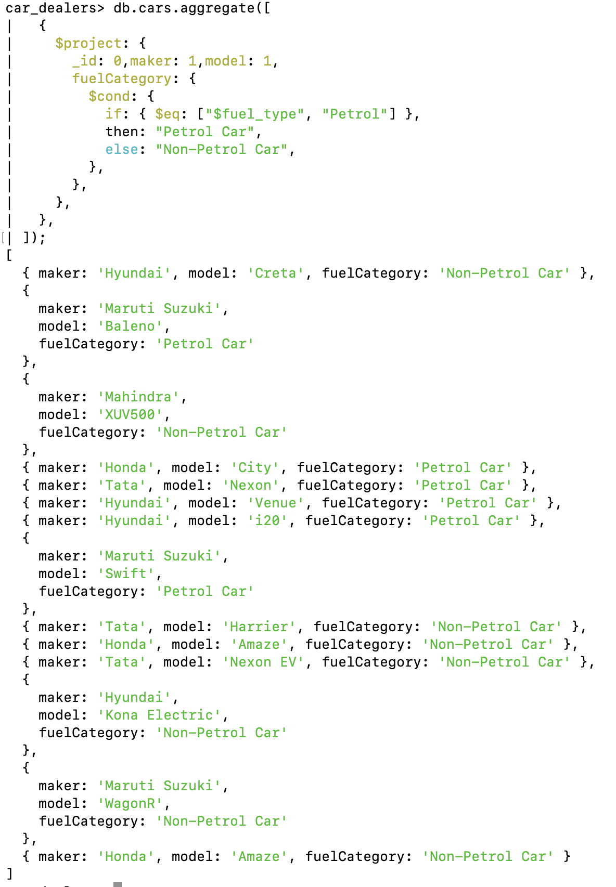
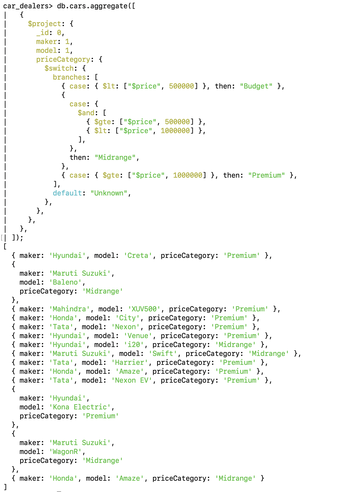

# Conditional Operators

- $cond
- $ifNull
- $switch

---

```

```

---

## 1. Cond - The $cond operator in mongoDB is a `ternary conditional operator`

Syntax

```js
{$cond:[<Condition>,<true-case>,<false-case>]}
```

### Use Case: Suppose we want to check if a car's fuel_type is "Petrol" and categorize the cars into `Petrol Car` & `Non-Petrol`

```js
db.cars.aggregate([
  {
    $project: {
      _id: 0,
      maker: 1,
      model: 1,
      fuelCategory: {
        $cond: {
          if: { $eq: ["$fuel_type", "Petrol"] },
          then: "Petrol Car",
          else: "Non-Petrol Car",
        },
      },
    },
  },
]);
```



---

```

```

---

## Switch

Syntax

```js
{
    $switch:{
        branches:[
            {case:<condition1>, then: <result>},
            {case:<condition2>, then: <result>},
            ...
        ],default:<default_Result>
    }
}
```

### Use Case: Suppose we want to categorize the price of the car into three categories: "Budget", "Midrange", and "Premium"

```js
db.cars.aggregate([
  {
    $project: {
      _id: 0,
      maker: 1,
      model: 1,
      priceCategory: {
        $switch: {
          branches: [
            // when price less than 5 lakh this it is budget
            { case: { $lt: ["$price", 500000] }, then: "Budget" },
            // when price between [5 lakh - 10 lakh) this it is midrange
            {
              case: {
                $and: [
                  { $gte: ["$price", 500000] },
                  { $lt: ["$price", 1000000] },
                ],
              },
              then: "Midrange",
            },
            // when price greather or equal to 10 lakh this it is midrange
            { case: { $gte: ["$price", 1000000] }, then: "Premium" },
          ],

          // if no condition satisfies then default will get executed
          default: "Unknown",
        },
      },
    },
  },
]);
```


