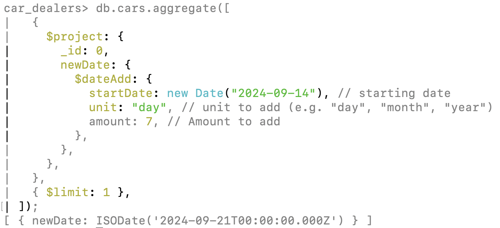

# Date Operators

- $dateAdd
- $dateDiff
- $month
- $year
- $hour
- $dateOfMonth
- $dayOfYear

Example

```js
db.cars.aggregate([
  {
    $project: {
      _id: 0,
      newDate: {
        $dateAdd: {
          startDate: new Date("2024-09-14"), // starting date
          unit: "day", // unit to add (e.g. "day", "month", "year")
          amount: 7, // Amount to add
        },
      },
    },
  },
  { $limit: 1 },
]);
```

- here we have provided a date, defined which type of addition like day, month or year, then we have provided the amount we want to increase
- it will result in date, 7 days ahead of the provided date

