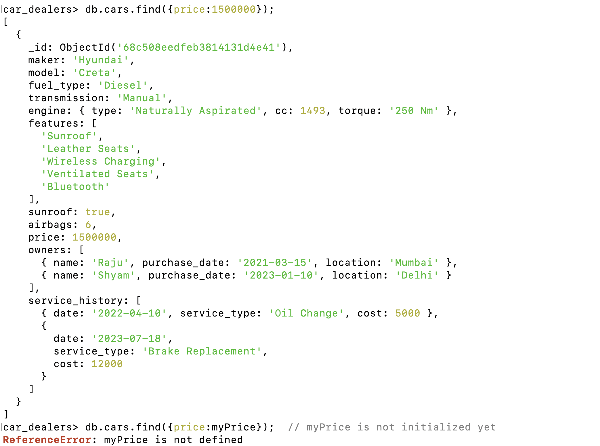
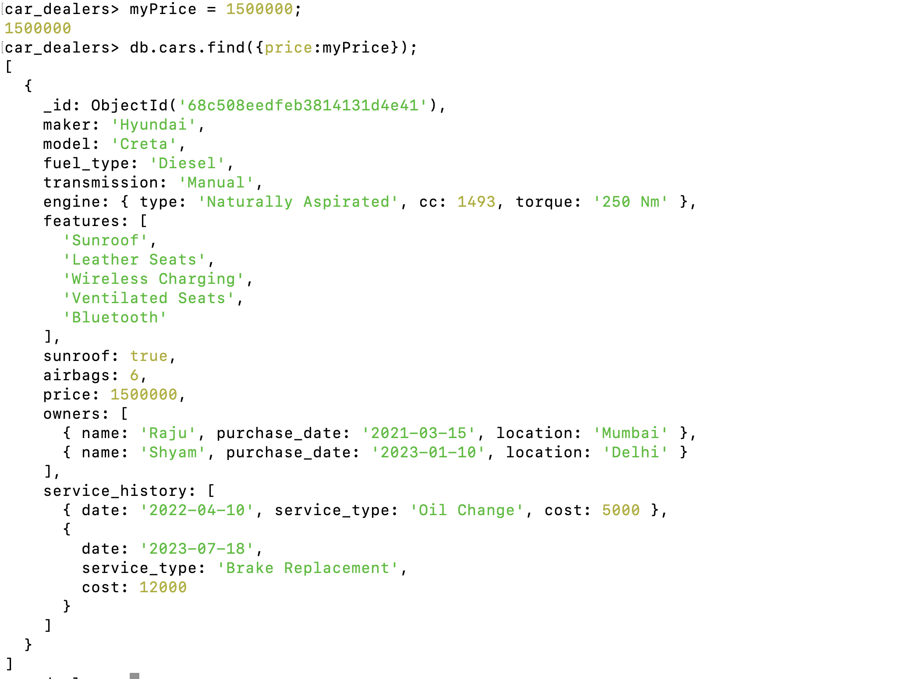
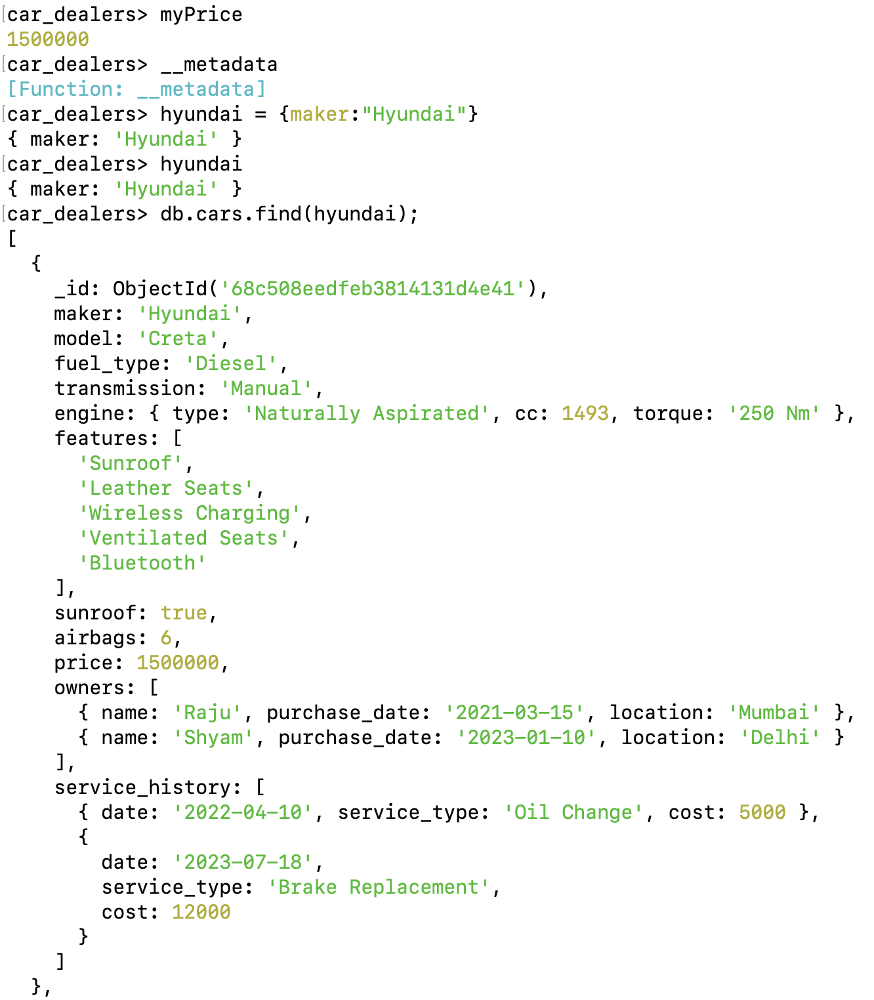

# Variables - [Link](https://www.mongodb.com/docs/v7.0/reference/aggregation-variables/)

Two types of variables:

1. System Generated Variables
2.

## 1. System Generated Variables

Example

```js
db.cars.aggregate({ $project: { _id: 0, model: 1, date: "$$NOW" } });
```


## 2. User Defined Variables

These variables allow you to store values and reuse them within the same pipeline, making the pipeline more readable and efficient in certain scenarios.

Example

```js
db.cars.aggregate([
  { $match: { maker: "Hyundai" } },
  { $set: { total_service_cost: { $sum: "$service_history.cost" } } },
  {
    $project: {
      maker: 1,
      model: 1,
      total_service_cost: 1,
      _id: 0,
      cost_status: {
        $let: {
          vars: { totalCost: "$total_service_cost" },
          in: {
            $cond: {
              if: { $gte: ["$$totalCost", 10000] },
              then: "High",
              else: "Low",
            },
          },
        },
      },
    },
  },
]);
```


### Important

1. To create your own variable in mongosh

```js
variableName = value;
```

`when variable was not declared`



`after variable declaration`



here we created an object of hyundai which we can use wherever we want



2. To check which variables are created in mongosh

```js
Object.keys(this); // it will tell us about all the variables which has been created in this database
```

List is quite huge and we can see the variable which we created `myPrice`


