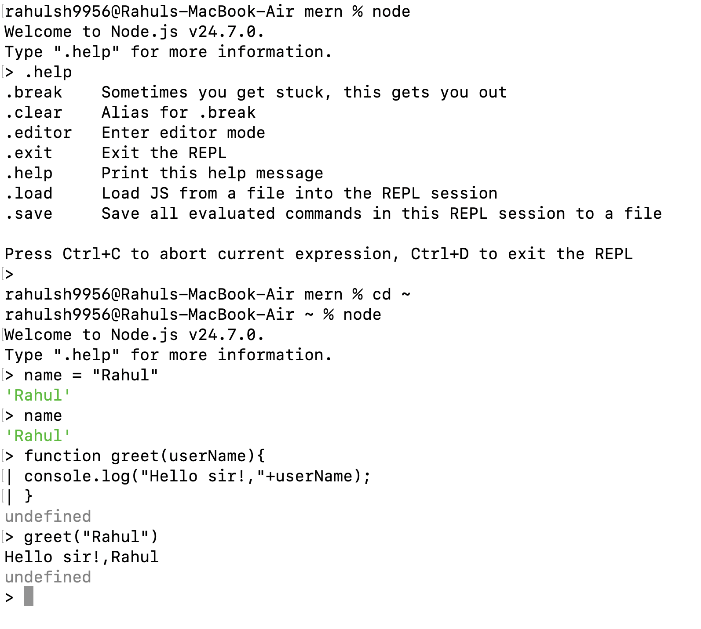

# REPL - stands for Read-Eval-Print Loop

`You could do all this stuff on terminal - by just typing 'node'`
`There you could create variables, functions, everything of node`

- The REPL module provides a implementation that is avaliable both as a standalone program or includible in other applications.

- Basically it's a place where you can write/run JS code.

- .break (sometimes you get stuck, this gets you out)
- .clear (Alias for .break)
- .editor (Enter editor mode (Ctrl+D) to finish, (Ctrl+C) to cancel)
- .exit (Exit the REPL)
- .help (Print this help message)
- .load (Loads JS from a file into the REPL session e.g .load .filepath)
- .save (Save all evaluated commands in this REPL session to a file e.g .save /filepath)

    
