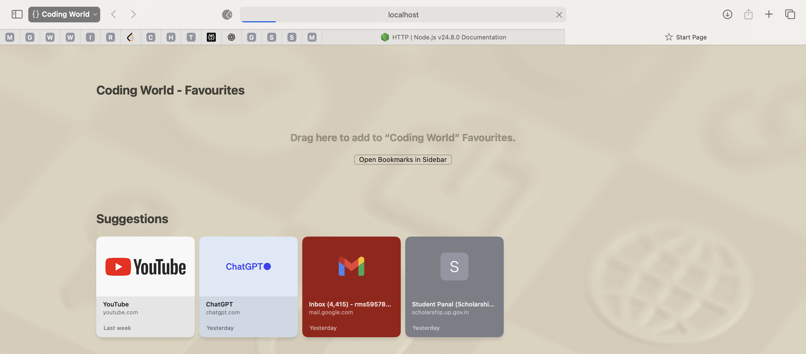
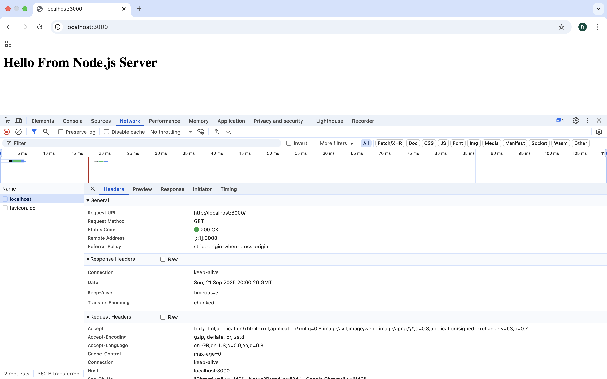
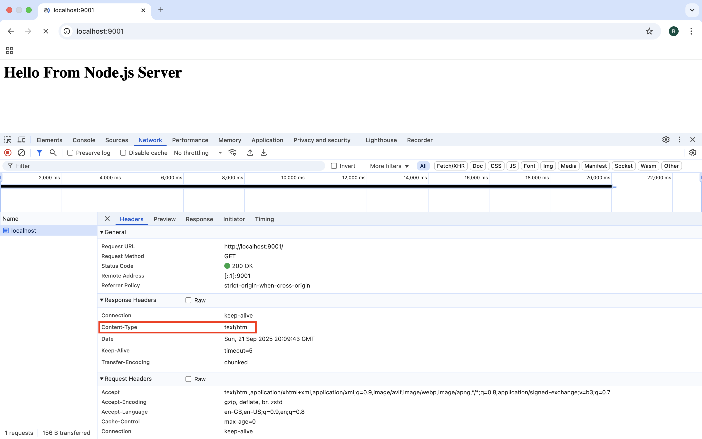

# Http Module - [Link](https://nodejs.org/api/http.html)

- When we just create server and just pass req of port nothing else

- You created the server, but the callback is empty.
- The browser makes a request, the server receives it (req), but you never call res.end().
- Without res.end(), the HTTP response is never completed, so the browser keeps waiting.



## Definition

The **`http` module** in Node.js allows Node.js to transfer data over the HyperText Transfer Protocol (HTTP).  
It is mainly used to create **web servers** and **clients**.

## Importing

```js
const http = require("http");
```

## Common Usage

### 1. Creating a Basic Http Server

```js
const http = require("http");

const server = http.createServer((req, res) => {
  res.statusCode = 200; // Success response
  res.setHeader("Content-Type", "text/plain");
  res.end("Hello, World!\n"); // Response body
});

server.listen(3000, () => {
  console.log("Server running at http://localhost:3000/");
});
```

### 2. Handling Requests

- Request Object (`req`) provides details about the request:
- `req.url` → URL requested
- `req.method` → HTTP method (GET, POST, etc.)
- `req.headers` → Request headers
  Example:

```js
const server = http.createServer((req, res) => {
  console.log(req.method, req.url); // Logs request method and URL
  res.end("Request received");
});
```

### 3. Sending Responses

- Response Object (`res`) is used to send back data:
- res.statusCode → Set status code
- res.setHeader() → Set response headers
- res.write() → Write chunks of data
- res.end() → End response
  Example:

```js
res.statusCode = 200;
res.setHeader("Content-Type", "application/json");
res.end(JSON.stringify({ message: "Success" }));
```

### 4. Creating an HTTP Client

Node.js can also **make requests** as a client.

```js
const options = {
  hostname: "example.com",
  port: 80,
  path: "/",
  method: "GET",
};

const req = http.request(options, (res) => {
  console.log(`Status: ${res.statusCode}`);
  res.on("data", (chunk) => {
    console.log(`Body: ${chunk}`);
  });
});

req.on("error", (err) => {
  console.error(err);
});

req.end();
```

### Events in HTTP Server

- `request` → Triggered when a request is received
- `connection` → Triggered when a new connection is established
- `close` → Triggered when the server closes

## Key Points

- `http` module is **built-in** (no installation required).
- Used to **create servers** (listen for requests) and clients (make requests).
- Often paired with the `url` module to parse request URLs.
- Default port for HTTP is **80**; for HTTPS, it’s **443**.

```

```

## We do not have content type in network section

```js
const server3 = http.createServer((req, res) => {
  res.write("<h1>Hello From Node.js Server</h1>");
  res.end();
});
server3.listen(3000, () => {
  console.log("Server3 Up!, running on post 3000");
});
```



## now we can see content type

```js
const server4 = http.createServer((req, res) => {
  res.setHeader("Content-Type", "text/html");
  res.write("<h1>Hello From Node.js Server</h1>");
});
server4.listen(9001, () => console.log("Server4 Up!, running on port 9001"));
```


