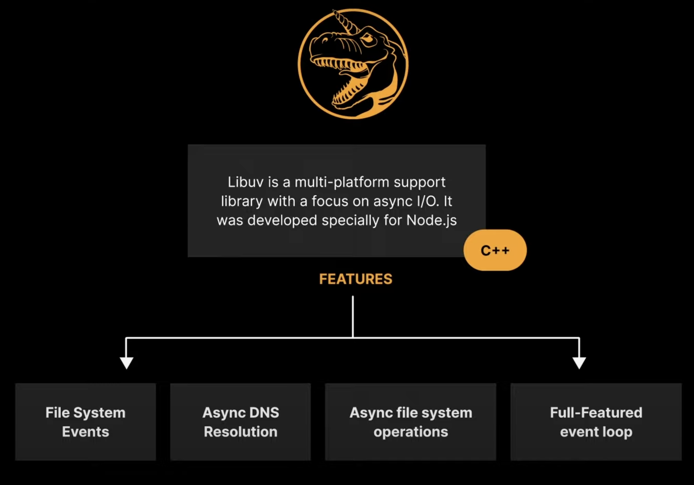
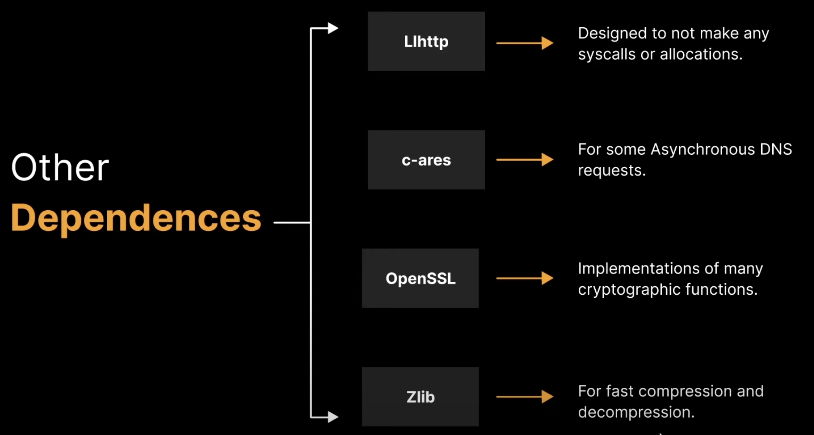
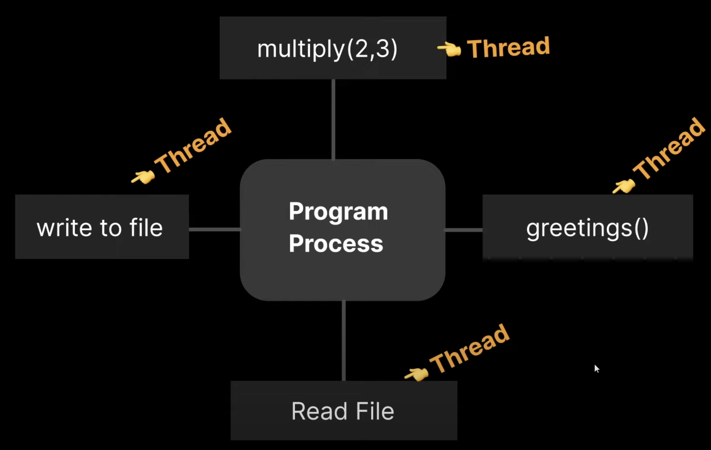
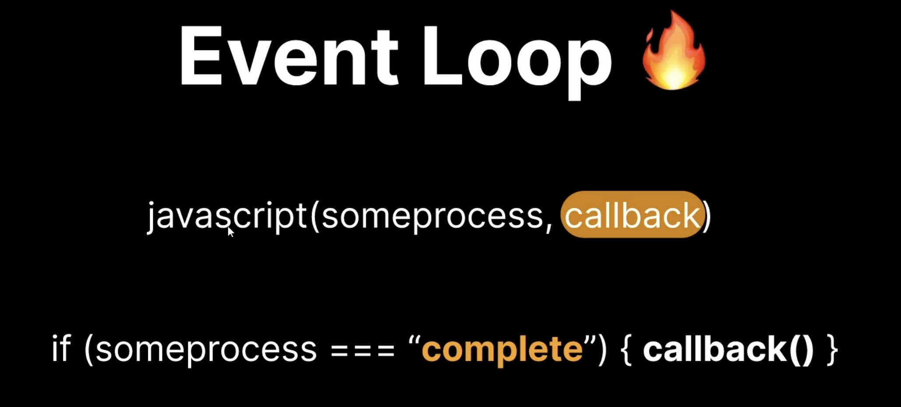
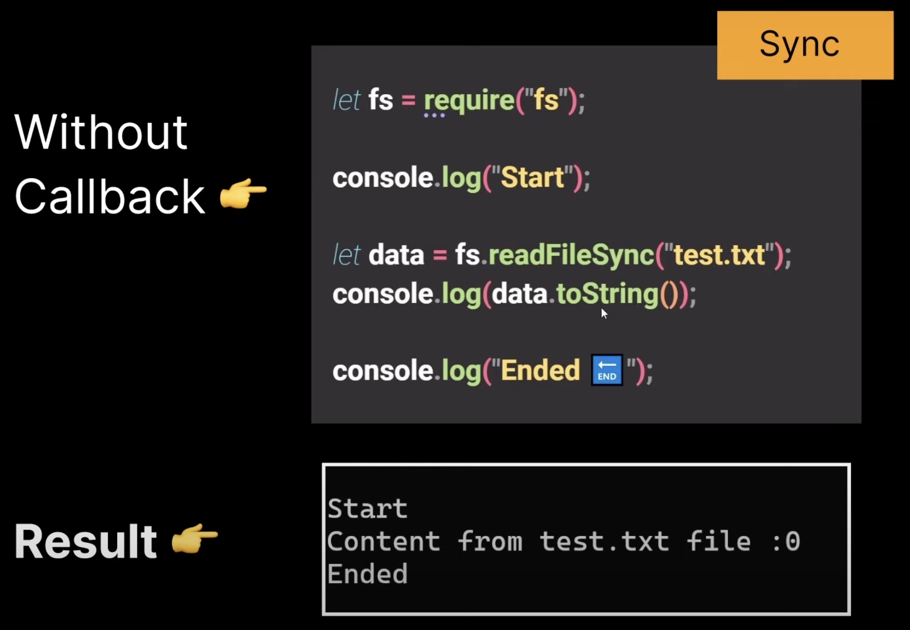
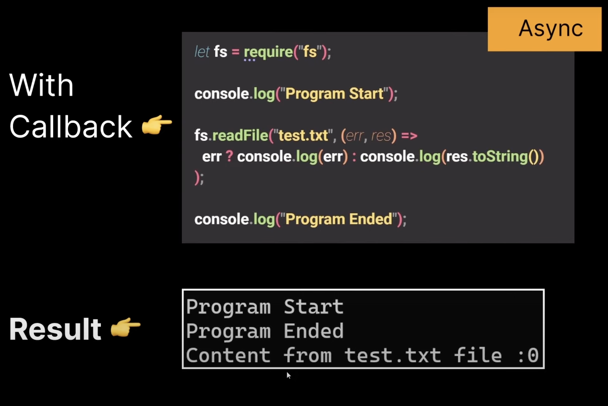

# Node Js Depenndecies

There are several node js dependencies and we are going to learn about these two main dependencies

Both of these are written in `C++`

1. V8 engine - `Coverts JS code into Machine Code` so that machine can understand.
2. Libuv - Opensource library with a `strong focus on Asynchronous I/O`

## Libuv Dependency Features

   

## Other Dependencies

   

## Thread

Each unit capable of executing code is called a thread.

### NOTE

- `Node.js is single threaded`, which means it can only do `"one"` thing at a time.
- Why?
- Because it uses JavaScript which is a single threaded programming language

## Event Loop

The event loop will be generated in the thread & the role of this loop is to `schedule` which operations our thread should be perfroming at any given point.

## Callback

- Callback is an `asynchronous equivalent` for a function.
- A callback function is called at the completion of a given task.
- `Callback` help us in `preventing` from the `blocking of the code`.
- Node makes heavy use of callbacks.

  `Example of blocking code - without callback function`

  

  `Example of non-blocking code - with callback function`

  

## Node Process

### `Explanation`

- This is the diagram of a `Single Thread in a Node Process`
- Step1: It will **Initialize Program**
- Step2: It will **Import modules** which are needed
- Step3: It will **Register the callbacks**
- Step4: It will only gets executed if there is heavy lifting in code (meaning some code is taking time and we want to do other stuff meanwhile)

This `Event Loop` will give us a `Thread Pool` containing 4 Threads in it

This helps us execute other tasks which take less time meanwhile other task which is taking more time will collect info required and then it will execute
