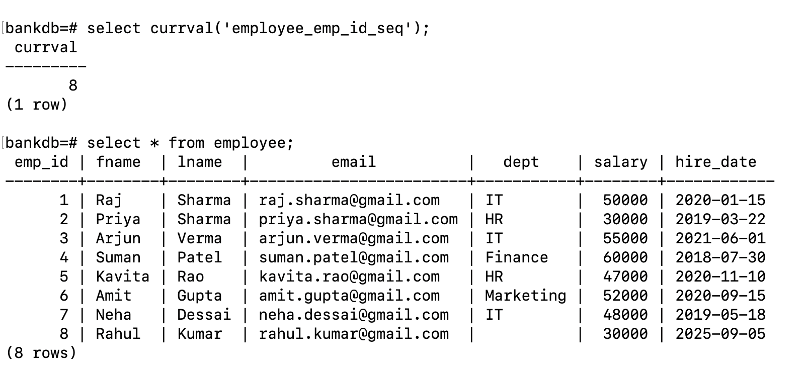
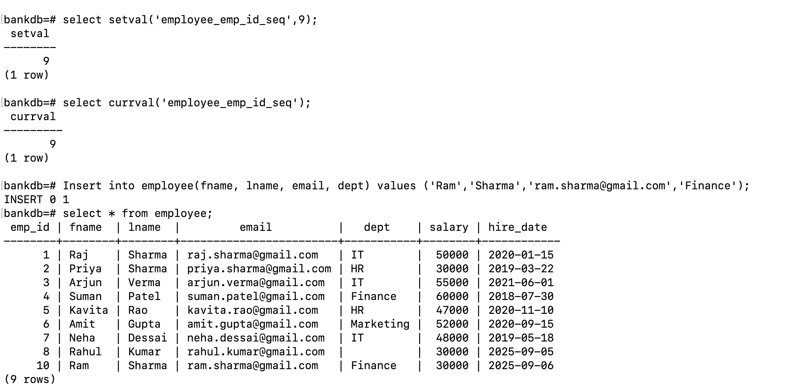

# Instructions

1. Create a Database with name `BankDB`
2. Create table Employees inside of this database

   Follow this Employee table structure
   

   - emp_id -> primary key, not null, auto_increment(Serial)
   - email -> unique
   - salary -> default salary 30k
   - hire_date -> date data type

# NOTE

- Problems can occur with primary key and serial

  1. If you do `not use serial from the begining` and you assign value manually in the begining then the `variable which assign serial values will not get initiated` and there will be `no value which is stored inside of it`.

  2. Or if you see any `error` like (duplicate key value violates unique constraint) or (key (emp_id)=1 already exists.duplicate key value violates unique constraint `employee_pkey`)

  To solve this problem you have to manually assign value to the variable which assigns value in serial

  - Steps to solve this problem
    1. run this command in terminal - `\d+ table_name` to get more info about the table
       - there you'll see something like this
         
       - here you see variable `employee_emp_id_seq`, this is the variable `responsible for handling serial constraint`
    2. run this command to check the current value - `SELECT currval('employee_emp_id_seq);`
       - current value of variable and compare it with the table's current value
         
    3. run this command to set the value of this variable according to your need
       - command `SELECT setval('employee_emp_id_seq',9);`
       - we updated value in variable, now value will start after the assigned value
         
