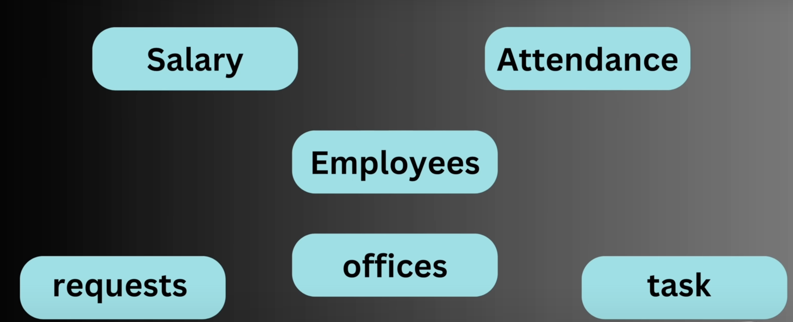
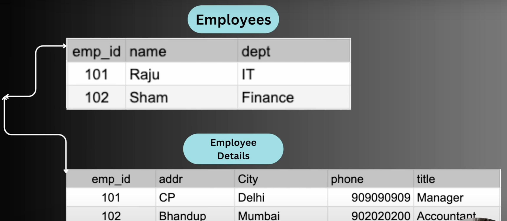
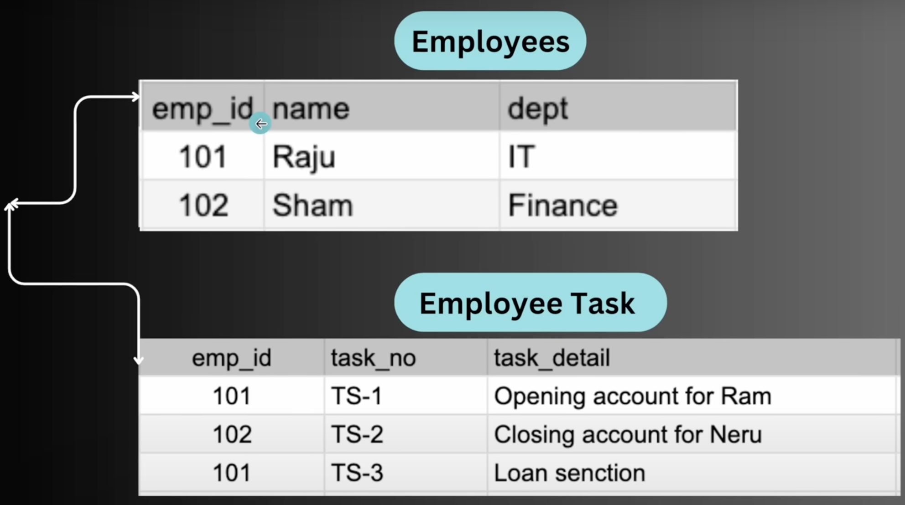

# REALTIONSHIPS

A **relationship** in databases defines how data in one table is related to data in another.  
They are implemented using **primary keys** and **foreign keys** to maintain **referential integrity**.

## 

## 🔑 Types of Relationships

### 1. One-to-One (1:1)

- Each row in **Table A** relates to **exactly one row** in **Table B**.
- Used when extra details about an entity are stored separately.
- Implemented with a **unique foreign key**.

Example

1 employee appear only 1 time in both the related tables

Example 2

````sql
# 📘 Relationships in Databases (PostgreSQL & SQL)

A **relationship** in databases defines how data in one table is related to data in another.
They are implemented using **primary keys** and **foreign keys** to maintain **referential integrity**.

---

## 🔑 Types of Relationships

### 1. One-to-One (1:1)
- Each row in **Table A** relates to **exactly one row** in **Table B**.
- Used when extra details about an entity are stored separately.
- Implemented with a **unique foreign key**.

**Example:**
```sql
CREATE TABLE employee (
    emp_id SERIAL PRIMARY KEY,
    name VARCHAR(50)
);

CREATE TABLE employee_details (
    emp_id INT UNIQUE REFERENCES employee(emp_id),
    address VARCHAR(100),
    phone VARCHAR(15)
);
````

📌 Each employee has exactly one detail record.

---

### 2. One-to-Many (1:N)

- A row in Table A can relate to multiple rows in Table B.
- Each row in Table B relates to only one row in Table A.
- Implemented with a foreign key in the “many” table.

Example 1


1 employee appear only 1 time in 1st table and 2nd related table it appears multiple times

Example 2

```sql
CREATE TABLE department (
    dept_id SERIAL PRIMARY KEY,
    dept_name VARCHAR(50)
);

CREATE TABLE employee (
    emp_id SERIAL PRIMARY KEY,
    name VARCHAR(50),
    dept_id INT REFERENCES department(dept_id)
);
```

📌 One department has many employees, but each employee belongs to one department.

---

### 3. Many-to-Many (M:N)

- A row in Table A can relate to many rows in Table B and vice versa.
- Implemented using a junction (bridge) table with two foreign keys.

Example

```sql
CREATE TABLE student (
    student_id SERIAL PRIMARY KEY,
    name VARCHAR(50)
);

CREATE TABLE course (
    course_id SERIAL PRIMARY KEY,
    course_name VARCHAR(50)
);

-- Junction Table
CREATE TABLE student_course (
    student_id INT REFERENCES student(student_id),
    course_id INT REFERENCES course(course_id),
    PRIMARY KEY (student_id, course_id)
);
```

📌 A student can enroll in many courses, and each course can have many students.

---
