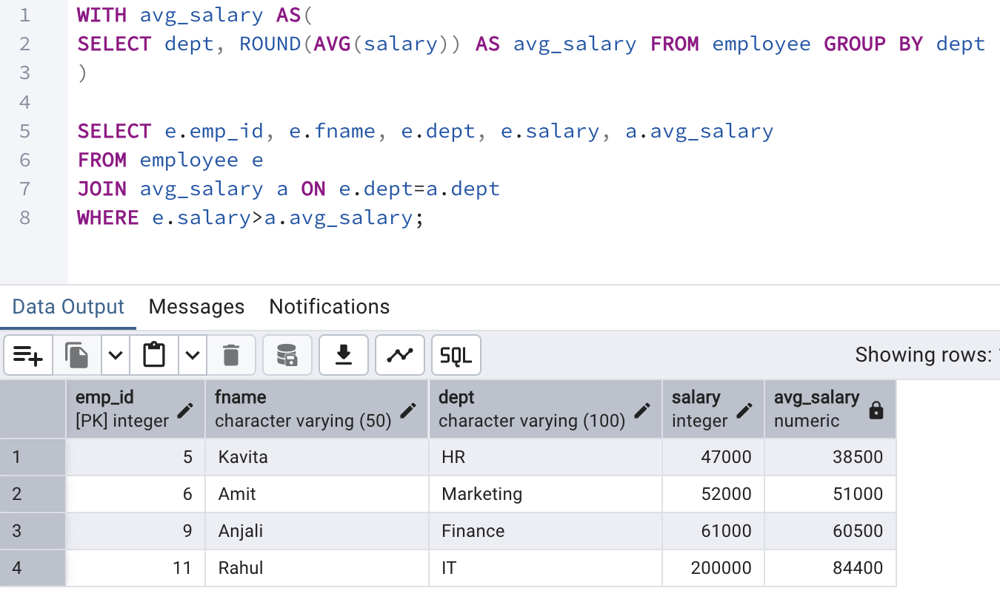

# CTE (Common Table Expression)

- is a temorary result set that you can define within a query to simplify complex SQL statements.
- Once a CTE has been created it can only be used once. It will not be persisted.

Syntax:

```sql
WITH cte_name (optional_column_list) AS (
    -- CTE QUERY DEFINITION
    SELECT ...
)

-- Main query refrencing the CTE
SELECT ...
FROM cte_name
WHERE ...;
```

Original Table


### Use Case 1

- We want to calculate the average salary per department and then find all employees whose salary is above the average salary of their department.


```sql
WITH avg_salary AS(
SELECT dept, ROUND(AVG(salary)) AS avg_salary FROM employee GROUP BY dept
)

SELECT e.emp_id, e.fname, e.dept, e.salary, a.avg_salary
FROM employee e
JOIN avg_salary a ON e.dept=a.dept
WHERE e.salary>a.avg_salary;

```



### Use Case 2

- We want to find the highest-paid employee in each department.


