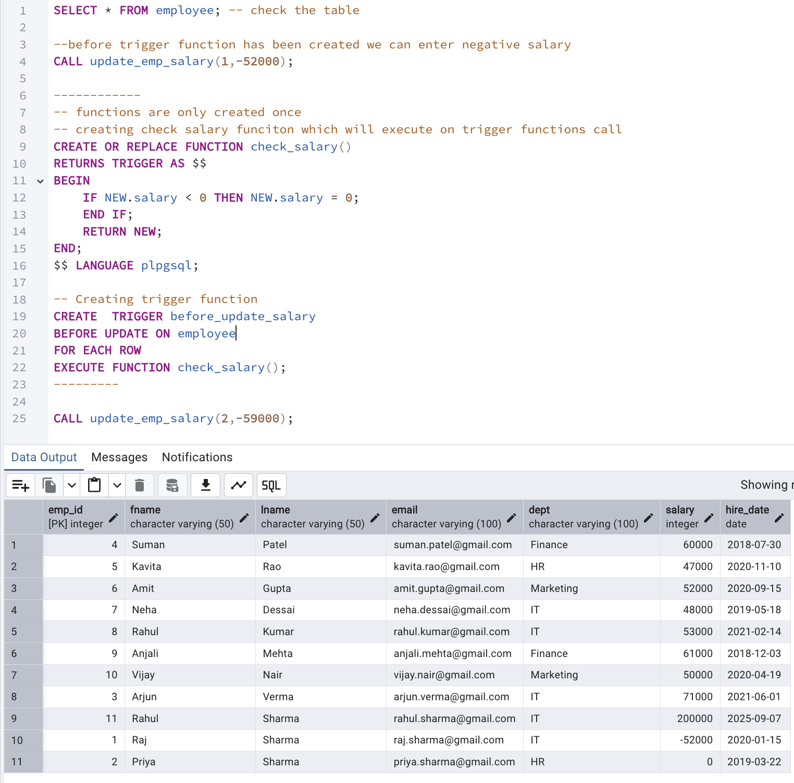

# Triggers

Triggers are special procedures in a database that automatically execute predefined actions in response to certain events on a specified table or view.

Syntax for trigger

```sql
CREATE TRIGGER trigger_name
{BEFORE | AFTER | INSTEAD OF} {INSERT | UPDATE | DELETE | TRUNCATE}
ON table_name
FOR EACH {ROW | STATEMENT}
EXECUTE FUNCTION trigger_function_name();
```

Syntax for trigger

```sql
CREATE OR REPLACE FUNCTION trigger_function_name()
RETURNS TRIGGER AS $$
BEGIN
    -- Trigger logic here
    RETURN NEW;
END;
$$ LANGUAGE plpgsql;
```

### USE CASE

Create a Trigger so that
If we insert/update negative slaary in a table, it will be triggered and set it to 0.


1.  we need to cerate these function only once

    - Check Salary function which will check the salary if it is negative then put value 0

    ```sql
    CREATE OR REPLACE FUNCTION check_salary()
    RETURNS TRIGGER AS $$
    BEGIN
    	IF NEW.salary < 0 THEN NEW.salary = 0;
    	END IF;
    	RETURN NEW;
    END;
    $$ LANGUAGE plpgsql;
    ```

    - This is our trigger function which calls the check_salary() and executes it for each row before updating the salary

    ```sql
    -- Creating trigger function
    CREATE  TRIGGER before_update_salary
    BEFORE UPDATE ON employee
    FOR EACH ROW
    EXECUTE FUNCTION check_salary();
    ```
